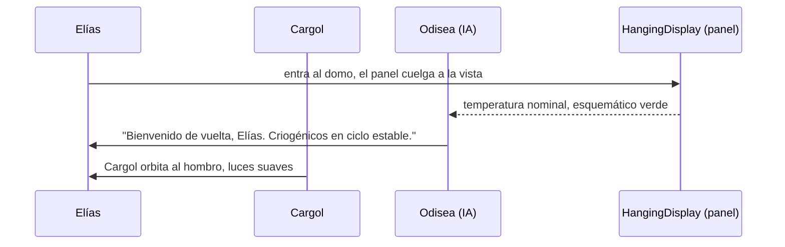
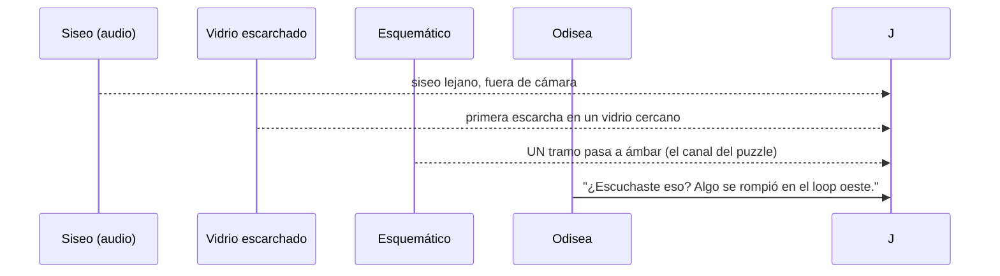
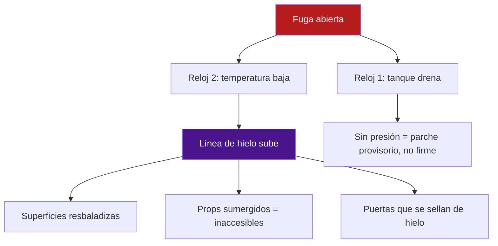
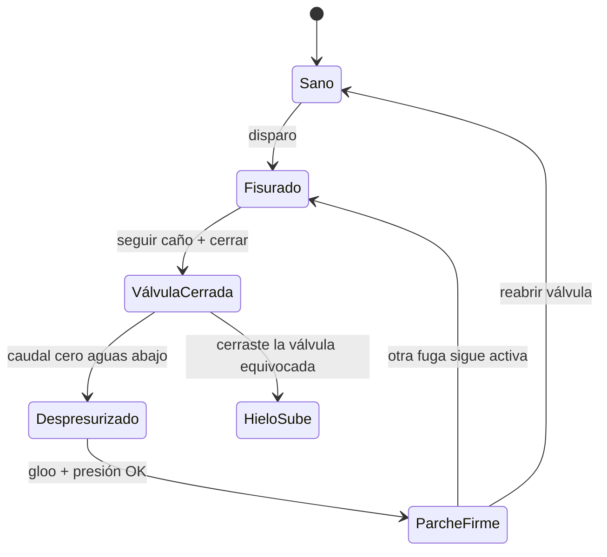
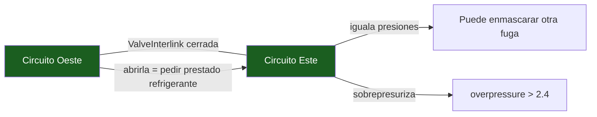

# Storyboard — Primer Puzzle: Fugas de refrigerante y línea de hielo

**Escena:** `Dome_Intro.tscn` · **Sistema:** FD-270 (red de tuberías) + FD-269 (Room3D) + `IceLevel`
**Autor:** Odiseo (con Sebastián) · **Fecha:** 2026-08-20
**Estado:** Propuesta de pacing y dirección — no toca código ni `.tscn`.

---

## 0. Tesis de dirección

> **"Primero enseñas la máquina sana. Luego la rompes. Y el frío —no un cronómetro— es tu reloj."**

El puzzle no se comunica con texto ni con números. Se comunica por **contraste**:
caudal vivo → muerto, templado → frío, verde → ámbar → rojo. Si el jugador no ve el
sistema *funcionando bien* primero, la avería no significa nada. Todo el primer acto
sirve para imprimir esa línea base en la memoria.

El pacing tiene tres movimientos:
1. **Respirar** — recorrer el loop sano, aprender la gramática "seguir el caño".
2. **Romper** — la fisura aparece sola, sin popup, como un síntoma.
3. **Reaccionar** — dos relojes físicos (tanque drena + hielo sube) que reforman el espacio.

---

## 1. Acto I — Prólogo relajado (línea base)

**Duración objetivo:** 60–90 s. **Riesgo:** cero. **Objetivo:** imprimir la gramática.

### Beat 1.1 — Entrada al domo

- **Cámara:** plano general lento (dolly-in) del domo, el panel colgante como punto de
  luz. Corte a over-the-shoulder (FD-042) cuando Elías entra.
- **Copy (Odisea):** *"Bienvenido de vuelta, Elías. Los criogénicos están en ciclo
  estable. Temperatura nominal."*

### Beat 1.2 — La lección de la gramática (el caño)

- **Cámara:** un travelling lento que *sigue el caño* desde el tanque hasta el sumidero.
  La cámara ES la gramática: mirar el caño = leer el sistema. Aquí se enseña la única
  regla que el jugador necesita recordar.
- **Copy (Odisea):** *"Mira el caño. Cada tramo que brilla es refrigerante fluyendo.
  Si algún día se apaga, síguelo hacia atrás hasta la válvula que lo alimenta."*
- **Cargol (opcional, refuerzo):** *"Flujo al 100 %. Nada que reparar. Aburrido en el
  buen sentido."*

### Beat 1.3 — Interacción de cero riesgo

Una válvula que ya está bien; girarla no rompe nada, solo confirma el vocabulario.

- **Cámara:** primer plano de la mano en la válvula (FD-044), micro-lock-on de cámara.
- **Copy:** nada hablado. Solo el click mecánico + el dial que no cambia. El silencio
  es información: *todo está bien*.

---

## 2. Acto II — La fisura (disparo)

**Duración:** 10–15 s. **Regla:** el síntoma llega *antes* que la explicación.

- **Cámara:** no cortar al panel todavía. Mantener al jugador *mirando*: un inserto
  del vidrio escarchándose, el audio siseando. Solo después, un corte suave al
  esquemático que cambió a ámbar. El orden es: **oír → ver → comprender**.
- **Copy (Odisea):** *"El flujo murió en una fisura. El frío que ves no es tu amigo.
  Sella la fisura y el refrigerante vuelve a correr."*

> **Regla de oro del disparo:** la primera fuga es **la fácil** — cerca del jugador,
> en el piso donde está, con la válvula a la vista. Sirve para que el ciclo
> *cerrar → parchear → reabrir* se aprenda como lección, no como agonía.

---

## 3. Acto III — La emergencia (dos relojes)

Aquí el puzzle deja de ser lineal y se vuelve interesante: **dos relojes físicos en
paralelo** que compiten por la atención del jugador.

### La tensión de recursos (lo que hace el puzzle "interesante")

1. **Cruzar la topología en el espacio** (§7.1 de FD-270): la válvula que alimenta la
   fuga que *ves* NO está a tu lado. Seguir el caño = navegar el domo, cruzar pisos,
   usar el ascensor (`ElevatorProp`, 6 niveles). "Seguir el caño" se convierte en
   navegación + memoria espacial.
2. **Cerrar mal tiene precio:** cerrar la válvula equivocada corta refrigeración a un
   tramo que aún la necesita → el hielo sube *ahí*. La decisión sistémica aparece.
3. **El tanque es el otro reloj:** con la fuga abierta, el tanque drena. Sin presión no
   se suelda en firme (`LeakPatchPoint` lee `is_pressurized_at`). Cerraste la válvula,
   sí, pero quizá ya no queda presión para el parche bueno.

### Pacing chart (relojes superpuestos)

```mermaid
gantt
    title Tensión de los dos relojes (primer puzzle)
    dateFormat X
    axisFormat %s
    section Tanque (presión)
    Lleno            :a1, 0, 40
    Drena (fuga abierta) :a2, 40, 60
    Bajo (parche provisorio) :a3, 60, 90
    section Hielo (espacio)
    Estable          :b1, 0, 45
    Sube lento       :b2, 45, 80
    Sella puertas    :b3, 80, 120
    section Jugador
    Explorar sano    :c1, 0, 40
    Detecta fisura   :c2, 40, 55
    Navega a válvula :c3, 55, 85
    Parchea          :c4, 85, 110
```

---

## 4. Acto IV — Resolución y clímax de hielo

El cierre no es "ganaste". Es **el alivio físico**: la corriente vuelve, el hielo deja
de subir, el esquemático pasa a verde.

- **Cámara:** plano medio del parche soldándose (el gloo), luego un tilt-up lento
  siguiendo la corriente que *vuelve* a correr por el caño. El mismo travelling del
  Beat 1.2, invertido — cierre de arco visual.
- **Copy (Odisea):** *"Bien hecho. El loop oeste respira de nuevo. La línea de hielo
  se detiene... por ahora."*

---

## 5. El "ah-ha" tardío — `ValveInterlink` (piso 5)

Reservado para cuando el jugador ya domina el ciclo. Es el puzle de regalo:

- **Copy (Odisea):** *"La interlink iguala presiones. Puedes robar refrigerante del
  circuito este... pero no verás bien qué fuga estás alimentando."*

---

## 6. Reglas de cámara (Godot 3, over-the-shoulder base FD-042)

| Momento | Plano | Intención |
|---|---|---|
| Entrada al domo | General lento (dolly-in) | escala + calma |
| Seguir el caño | Travelling que recorre el pipe | enseñar la gramática |
| Válvula | Primer plano mano + micro-lock | confirmar el vocabulario |
| Fisura (disparo) | Inserto vidrio → corte a esquemático | oír → ver → comprender |
| Navegación a válvula | Over-shoulder normal | gameplay |
| Parche + reapertura | Tilt-up siguiendo el flujo | alivio / cierre de arco |
| Hielo subiendo | Contrapicado bajo la línea de hielo | amenaza física |

**Regla transversal:** la cámara *nunca* apunta sola al HUD o al panel. El panel entra
en cuadro solo como consecuencia de lo que el jugador mira. El canal primario es el
mundo (el caño, el vidrio, el hielo), no la UI.

---

## 7. Tabla de copys (versión 1)

| # | Momento | Voz | Línea |
|---|---|---|---|
| 1 | Entrada | Odisea | "Bienvenido de vuelta, Elías. Los criogénicos están en ciclo estable. Temperatura nominal." |
| 2 | Gramática | Odisea | "Mira el caño. Cada tramo que brilla es refrigerante fluyendo. Si se apaga, síguelo hacia atrás hasta la válvula que lo alimenta." |
| 3 | Gramática | Cargol | "Flujo al cien. Nada que reparar. Aburrido en el buen sentido." |
| 4 | Disparo | Odisea | "¿Escuchaste eso? Algo se rompió en el loop oeste." |
| 5 | Disparo | Odisea | "El flujo murió en una fisura. El frío que ves no es tu amigo. Sella la fisura y el refrigerante vuelve a correr." |
| 6 | Emergencia | Odisea | "Sella la fisura antes de que el hielo selle las puertas." |
| 7 | Hielo | Odisea | "La línea de hielo sube. Cada metro es una superficie que deja de ser tuya." |
| 8 | Resolución | Odisea | "Bien hecho. El loop oeste respira de nuevo. La línea de hielo se detiene... por ahora." |
| 9 | Interlink | Odisea | "La interlink iguala presiones. Puedes robar refrigerante del circuito este... pero no verás bien qué fuga alimentas." |

---

## 8. Decisiones pendientes para Sebastián

1. **¿El hielo reforma el espacio** (superficies resbaladizas, props sumergidos) **o es
   solo visual + daño?** Hoy `IceLevel` ya tiene collider y daño por contacto; la parte
   de "reformar el espacio" es nueva.
2. **¿Dónde calibrar primero:** en `Dome_Intro` directo, o cerrar el banco `CoolantLab`
   (L1–L5 de FD-270) para fijar el criterio visual del "caño que muere en la fisura"?
3. **¿La primera fuga es siempre fija** (tutorial determinista) **o también la sortea**
   `RandomLeakSeeder`? Para enseñar, recomiendo fija; el seeder arranca a partir de la
   segunda.
4. **D4 de FD-270 sigue abierto:** ¿umbral de parche firme `0.2` de caudal, o `0.0`
   estricto? Afecta la lectura "sin presión no hay parche bueno" del Acto III.
