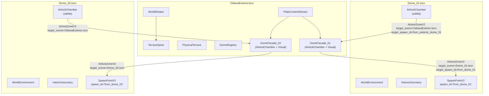

# Arquitectura de Escenas: Domos Exteriores + Interiores vía Airlock

**Status:** Plan / Diseño  
**Created:** 2026-05-23  
**Related:** FD-021 (Scene Transition), FD-025 (Tube/Airlock Connector), FD-036 (Gravity Manager)

---

## 1. Contexto

El juego transcurre en una nave espacial cilíndrica (Odisea) con:
- Un **exterior centrifugo** donde el jugador camina sobre terrazas en una espiral (`WorldRotator` + `TerraceSpiral`)
- Múltiples **domos** (interiores presurizados) distribuidos a lo largo de la espiral
- **Airlocks** como punto de transición entre exterior e interior — el jugador camina por un tubo de ~8m que enmascara la carga de escena

### Estado actual

| Componente | Estado |
|---|---|
| `AirlockZoneV2` + `AirlockControllerV2` | ✅ Funcional — carga async, progress tracking, soft stall |
| `SceneManager` | ✅ Funcional — `goto_scene()` con spawn_id, state_data, airlock_relative_transform |
| `TestWorldRotator.tscn` | ✅ Prototipo exterior con `WorldRotator` + `TerraceSpiral` + `PlateContentStream` |
| `AirlockChamber.tscn` | ✅ Prop reutilizable (cilindro 7m diámetro, 8m largo, 2 IrisDoorV2) |
| `Interior_A.tscn` / `Terrace_A.tscn` | ✅ Prototipos mínimos — transición funciona ida/vuelta |
| Escenas interiores reales | ❌ No existen |
| Registro de domos | ❌ No existe |

---

## 2. Escena EXTERIOR: `OdiseaExterior.tscn`

### 2.1 Plantilla base

Se usa `TestWorldRotator.tscn` como punto de partida, renombrado y reestructurado:

```
OdiseaExterior (Spatial)
├── WorldEnvironment (Environment_SpaceExterior.tres)
├── Pilot (Pilot_v2.tscn)                    ← El jugador
├── WorldRotator (WorldRotator.tscn)
│   ├── TerraceSpiral_A (TerraceSpiral)       ← Espiral principal
│   ├── TerraceSpiral_B (TerraceSpiral)       ← Espiral secundaria (opcional)
│   ├── InfiniteScaffold                      ← Infraestructura procedural
│   └── FauxSkydome                           ← Cielo parallax
├── PlateContentStream                        ← Contenido de gameplay por plate
├── PhysicalTerrace (StaticBody)              ← Colisión del plate activo
├── DomeRegistry (Node, script)               ← Índice domo → escena interior
└── ExteriorAirlocks (Spatial)                ← Contenedor de airlocks exteriores
    ├── DomeAirlock_01 (AirlockChamber.tscn)
    ├── DomeAirlock_02 (AirlockChamber.tscn)
    └── ...
```

### 2.2 Identificación de domos

Cada domo tiene un **ID string único** que lo identifica consistentemente en ambas escenas:

```
dome_id := "dome_01"  # Convención: dome_XX (numérico, 2 dígitos)
```

Este ID se usa para:
- `target_spawn_id` en `AirlockZoneV2` (e.g. `"from_dome_01"`)
- Clave en el `DomeRegistry` para resolver la escena interior
- `spawn_id` del `SpawnPointV2` en la escena interior

### 2.3 Ubicación de airlocks exteriores

Los airlocks exteriores **viven como hijos de `PlateContentStream`**, no directamente en la escena exterior. Razones:

1. **Cada domo está asociado a una plate específica** de la espiral — el airlock debe moverse con esa plate
2. `PlateContentStream` ya maneja instanciación/destrucción por proximidad al jugador
3. Al estar en un slot del stream, el airlock solo existe cuando el jugador está cerca, ahorrando recursos

**Alternativa evaluada y descartada**: Poner airlocks directamente en `ExteriorAirlocks` como nodos estáticos. Problema: en modo centrifugo, la posición global de las plates cambia con el `WorldRotator` — los airlocks se desalinearían de su plate.

**Implementación concreta:**
- Crear una escena `DomeFacade_XX.tscn` por domo que contiene:
  - El `AirlockChamber.tscn` posicionado en el borde de la plate
  - Visual exterior del domo (cúpula, paredes, decoración)
  - `AirlockZoneV2` configurado con `target_scene` y `target_spawn_id`
- Registrar cada `DomeFacade_XX.tscn` en `PlateContentStream` via `PlateSlotConfig` o `assign_scene()`

### 2.4 DomeRegistry: índice de domos

Un **script autoload o nodo** que mapea `dome_id` → metadata:

```gdscript
# core_v2/data/DomeRegistry.gd
extends Node
class_name DomeRegistry

# Registro declarativo: dome_id → config
var _registry := {
    "dome_01": {
        "interior_scene": "res://core_v2/levels/interiors/Dome_01.tscn",
        "facade_scene": "res://core_v2/levels/facades/DomeFacade_01.tscn",
        "spiral_index": 0,
        "plate_index": 42,
        "display_name": "Laboratorio Biológico",
        "spawn_id_from_exterior": "from_dome_01",
        "spawn_id_from_interior": "from_exterior_dome_01"
    },
    "dome_02": {
        "interior_scene": "res://core_v2/levels/interiors/Dome_02.tscn",
        "facade_scene": "res://core_v2/levels/facades/DomeFacade_02.tscn",
        "spiral_index": 0,
        "plate_index": 86,
        "display_name": "Bahía de Ingeniería",
        "spawn_id_from_exterior": "from_dome_02",
        "spawn_id_from_interior": "from_exterior_dome_02"
    }
}

func get_dome(dome_id: String) -> Dictionary:
    return _registry.get(dome_id, {})

func get_interior_scene(dome_id: String) -> String:
    return _registry.get(dome_id, {}).get("interior_scene", "")

func get_all_dome_ids() -> Array:
    return _registry.keys()
```

**¿Por qué un script y no JSON?**
- Un `.gd` con diccionario constante es más rápido de acceder que parsear JSON en runtime
- Permite validación en tiempo de carga (assert que las escenas existen)
- Si crece mucho, se puede migrar a JSON sin cambiar la API

**¿Autoload o nodo en la escena?**
- **Nodo en la escena exterior** por ahora — no necesitamos el registry en escenas interiores (el interior ya sabe su propio `dome_id`)
- Si en el futuro un interior necesita consultar otros domos (e.g. para un mapa), se promueve a autoload

---

## 3. Escenas INTERIORES: `Dome_XX.tscn`

### 3.1 Estructura: escenas independientes

Cada domo interior es un archivo `.tscn` **independiente y auto-contenido**:

```
Dome_01 (Spatial)                             ← Raíz
├── WorldEnvironment (Environment_InteriorLab.tres)
├── Pilot (Pilot_v2.tscn)                    ← Instancia local del jugador
├── Spawn_FromExterior (SpawnPointV2)         ← spawn_id = "from_dome_01"
├── AirlockExit (AirlockChamber.tscn)        ← Airlock de salida
│   └── AirlockZoneV2
│       ├── target_scene = "res://core_v2/levels/OdiseaExterior.tscn"
│       ├── target_spawn_id = "from_exterior_dome_01"
│       └── target_airlock_path = "DomeAirlock_01"
├── InteriorGeometry (Spatial)
│   ├── QodotMap (si usa TrenchBroom) ó CSG geometry
│   ├── Floor, Walls, Ceiling
│   └── DomeCeiling (visual cúpula interior)
├── Lighting (Spatial)
│   ├── KeyLight (OmniLight o DirectionalLight)
│   ├── AmbientFill
│   └── WorkLights (SciFiHangingLightV2, etc.)
├── Props (Spatial)
│   ├── TableTerminal, HoloTerminalV2, etc.
│   └── PushableBoxV2, PressurePlate, etc.
└── GameplayElements (Spatial)
    ├── Conveyors, MovingPlatforms
    ├── Doors, Levers
    └── NPCs (futuro)
```

### 3.2 ¿Plantilla base compartida?

**No se usa una plantilla/herencia de escena** por ahora. Razones:

1. Godot 3 inherited scenes son frágiles — cambios en la base rompen overrides en hijos
2. Cada domo tiene geometría y gameplay radicalmente diferente
3. La consistencia se logra por **convención**, no por herencia:
   - Siempre tiene un `WorldEnvironment`
   - Siempre tiene un `Pilot` (o lo inyecta `SessionManager`)
   - Siempre tiene un `SpawnPointV2` con `spawn_id = "from_dome_XX"`
   - Siempre tiene un `AirlockChamber` de salida con `AirlockZoneV2` configurado

**Alternativa futura:** Si se necesitan 20+ domos con estructura repetitiva, crear un `InteriorTemplate.tscn` base con slots vacíos. Pero para el MVP (3-5 domos) la convención es suficiente.

### 3.3 Contenido de cada interior

| Componente | Obligatorio | Descripción |
|---|---|---|
| `WorldEnvironment` | ✅ | Environment propio (no hereda del exterior) |
| `Pilot` | ✅ | Instancia del jugador (o lo crea `SessionManager`) |
| `SpawnPointV2` | ✅ | Con `spawn_id` correspondiente al `dome_id` |
| `AirlockChamber` | ✅ | Airlock de salida hacia el exterior |
| Geometría | ✅ | QodotMap o CSG — define el espacio habitable |
| Iluminación | ✅ | Al menos 1 key light + ambiente |
| Props interactivos | Variable | Según el gameplay del domo |
| `PlateContentRoot` | ❌ | No aplica — no hay WorldRotator en interiores |

### 3.4 Cómo sabe un interior a qué domo pertenece

El interior **no necesita saber su `dome_id`** en runtime. La relación es implícita:

1. El `AirlockZoneV2` del interior tiene `target_scene` → la escena exterior
2. El `target_spawn_id` del interior es `"from_exterior_dome_XX"` → el `SpawnPointV2` en el exterior (o el airlock del exterior que tiene ese spawn_id)
3. El `target_airlock_path` apunta al nodo del airlock exterior donde debe reaparecer

Si un interior necesita conocer su `dome_id` (e.g. para UI, diálogo, quest tracking):
- Exportar una variable `dome_id` en el script raíz del interior
- O consultar `DomeRegistry` buscando qué dome apunta a esta escena

---

## 4. Airlock Consistente (Continuidad Visual)

### 4.1 Principio fundamental

> El jugador debe percibir que **cruza un único tubo físico** — la transición de escena es invisible.

Esto requiere que ambos lados del airlock (exterior e interior) sean **visualmente idénticos**.

### 4.2 Implementación

Ambas escenas instancian **la misma escena** `AirlockChamber.tscn`:

```
AirlockChamber.tscn (compartido)
├── AirlockControllerV2 (script)
├── CylindricalShell (CSGCombiner)         ← Mismo material, mismo radio
│   ├── OuterTube (CSGCylinder, r=3.5m)
│   └── InnerVoid (CSGCylinder, r=2.8m)
├── Floor (CSGBox)                          ← Mismo material oscuro
├── CeilingStrip (CSGBox)                   ← Misma franja luminosa
├── OuterDoor (IrisDoorV2)                  ← Misma puerta iris
├── InnerDoor (IrisDoorV2)                  ← Misma puerta iris
├── ChamberZone (Area)
├── AirlockZoneV2 (Area)
├── AirlockSafetyFloor (StaticBody)
├── LoadingRedLight (OmniLight, rojo)       ← Mismas luces indicadoras
└── ReadyGreenLight (OmniLight, verde)      ← Mismas luces indicadoras
```

### 4.3 Environment dentro del airlock

El airlock tiene **su propio micro-environment** que no cambia entre escenas:

- **Opción A (recomendada para MVP):** No usar environment override dentro del tubo. El fade-out de `AirlockZoneV2` (0.2s) ocurre al 90% del recorrido — el jugador aún ve el interior del tubo, y el fade es tan corto que el cambio de environment es imperceptible.

- **Opción B (futura):** Agregar un `WorldEnvironment` hijo dentro de `AirlockChamber.tscn` con un environment neutro de transición. Requiere `Environment.background_mode = CLEAR_COLOR` con el color del interior del tubo.

### 4.4 Orientación y posición relativa

`AirlockZoneV2` ya maneja esto correctamente:
1. Captura `airlock_relative_transform` al trigger (posición del player relativa al airlock)
2. `SceneManager._apply_spawn_and_state()` busca el airlock destino via `target_airlock_path`
3. Aplica la misma posición relativa: `target_airlock.global_transform * relative_transform`
4. Restaura orientación de cámara via `camera_relative_forward`
5. Abre la puerta de salida correspondiente via `open_exit_door()`

El resultado: el jugador aparece en la **misma posición dentro del tubo** en la nueva escena.

---

## 5. Flujo de Juego Completo

### 5.1 Exterior → Interior

```
1. Player camina por la espiral centrifuga
2. Ve un domo — visual del DomeFacade_XX (cúpula, señalización, luces)
3. Se acerca al airlock del domo
4. body_entered → AirlockZoneV2 comienza carga async de Dome_XX.tscn
5. Player camina por el tubo (~3-4 segundos)
   - Luces rojas mientras carga
   - Luces verdes cuando Dome_XX.tscn está listo
   - Si no ha cargado al 85%: soft stall (player se frena suavemente)
6. Al 90%: AirlockZoneV2 dispara transición
   - Captura airlock_relative_transform, camera_yaw/pitch
   - SceneManager.goto_scene("Dome_XX.tscn", state_data)
7. SceneManager:
   - Elimina OdiseaExterior.tscn
   - Instancia Dome_XX.tscn
   - Busca AirlockChamber via target_airlock_path
   - Posiciona player en airlock_relative_transform
   - Abre puerta de salida (inner door)
   - Restaura cámara
8. Player sale del airlock → está dentro del domo
```

### 5.2 Interior → Exterior

```
1. Player camina hacia el airlock de salida del domo
2. body_entered → AirlockZoneV2 comienza carga async de OdiseaExterior.tscn
3. Player camina por el tubo
4. Al 90%: transición a OdiseaExterior.tscn
5. SceneManager:
   - Instancia OdiseaExterior.tscn
   - Busca DomeAirlock_XX via target_airlock_path
   - Posiciona player en la misma posición relativa del airlock
   - Abre puerta de salida (outer door)
   - WorldRotator + PlateContentStream se inicializan
6. Player sale del airlock → está en la espiral, frente al domo
```

### 5.3 Conservación de posición en la espiral

Al volver al exterior, el player debe aparecer **frente al mismo domo**. Esto se logra porque:

1. El `target_spawn_id` del airlock interior apunta a un `SpawnPointV2` en el exterior colocado junto al airlock de ese domo
2. Alternativamente, `target_airlock_path` apunta directamente al `AirlockChamber` exterior, y `airlock_relative_transform` posiciona al player dentro del tubo
3. `WorldRotator` se inicializa y eventualmente `select_nearest_plate_on_ready` ubica la rotación correcta para la plate del domo

> **Nota:** Si `PlateContentStream` maneja los airlocks exteriores, el airlock debe existir al momento de la transición. Solución: el airlock exterior del domo activo se **pre-instancia** siempre (no depende de proximidad para existir). Ver sección 6.

---

## 6. Archivos a Crear y Modificar

### 6.1 Archivos a CREAR

**Prioridad 1 — Fundación (implementar primero):**

| Archivo | Descripción |
|---|---|
| `core_v2/data/DomeRegistry.gd` | Registro dome_id → escena interior + metadata |
| `core_v2/levels/OdiseaExterior.tscn` | Escena exterior principal (basada en TestWorldRotator.tscn) |
| `core_v2/levels/interiors/Dome_01.tscn` | Primer interior real (laboratorio/taller) |
| `core_v2/levels/facades/DomeFacade_01.tscn` | Fachada exterior del domo 01 (visual + airlock) |

**Prioridad 2 — Expansión (después de validar el flujo):**

| Archivo | Descripción |
|---|---|
| `core_v2/levels/interiors/Dome_02.tscn` | Segundo interior (ingeniería/mecánica) |
| `core_v2/levels/facades/DomeFacade_02.tscn` | Fachada exterior del domo 02 |
| `core_v2/tests/test_dome_transition.gd` | Test de integración: exterior ↔ interior ida/vuelta |
| `core_v2/tests/test_dome_transition.oys` | OYS script para validar flujo visual |

**Prioridad 3 — Polish:**

| Archivo | Descripción |
|---|---|
| `scenes/common/space_environment/Environment_AirlockNeutral.tres` | Environment neutro para dentro del tubo (opcional) |
| `materials/airlock/AirlockInterior.tres` | Material compartido para interiores de airlock |
| `core_v2/levels/interiors/Dome_03.tscn` | Tercer interior |

### 6.2 Archivos a MODIFICAR

| Archivo | Cambio |
|---|---|
| `core_v2/props/AirlockChamber.tscn` | Verificar que el `AirlockZoneV2` child tiene exports accesibles para `target_scene`, `target_spawn_id`, `target_airlock_path`. Actualmente funcional — cambios mínimos. |
| `core_v2/levels/Terrace_A.tscn` | Evolucionar a la fachada `DomeFacade_01.tscn` o mantener como legacy de prueba. |
| `core_v2/levels/Interior_A.tscn` | Evolucionar a `Dome_01.tscn` o mantener como legacy de prueba. |
| `project.godot` | Agregar `DomeRegistry` como autoload si se decide esa ruta (ver sección 2.4). |
| `core_v2/autoloads/SessionManager.gd` | Verificar que `apply_scene_transition_state()` funciona correctamente con los nuevos spawn_ids y airlock paths. |

### 6.3 Archivos que NO se tocan

| Archivo | Razón |
|---|---|
| `AirlockZoneV2.gd` | Ya funcional, no requiere cambios para este plan |
| `AirlockControllerV2.gd` | Ya funcional |
| `SceneManager.gd` | Ya soporta todo el flujo (airlock_relative_transform, target_airlock_path, etc.) |
| `SpawnPointV2.gd` | Suficiente con el `spawn_id` existente |
| `WorldRotator.gd` | No requiere cambios — los airlocks viven fuera del WorldRotator |
| `PlateContentStream.gd` | Ya soporta `assign_scene()` y `PlateSlotConfig` |

---

## 7. Preguntas Abiertas

### 7.1 ¿PlateContentStream para airlocks exteriores, o nodos estáticos?

**Opción A: PlateContentStream (recomendada)**
- ✅ Airlocks se mueven con su plate en modo centrifugo
- ✅ Solo existen cuando el player está cerca (optimización)
- ⚠️ Riesgo: al volver del interior, el airlock exterior podría no estar instanciado aún si el player no está en rango

**Opción B: Nodos estáticos en ExteriorAirlocks**
- ✅ Siempre existen — garantía de que el target_airlock_path funciona
- ❌ No se mueven con la plate — se desalinean en modo centrifugo
- ❌ Muchos airlocks = overhead en escenas grandes

**Solución propuesta:** Usar PlateContentStream pero con una **ventana amplia** para las plates que tienen domos (`auto_plate_window_before/after` suficientemente grande). Alternativamente, los DomeFacade podrían tener un flag `always_loaded = true` en el stream.

### 7.2 ¿Cómo inicializa WorldRotator al volver del interior?

Al cargar `OdiseaExterior.tscn`, el WorldRotator parte desde cero. Necesita:
1. Saber en qué plate estaba el jugador (la plate del domo)
2. Hacer `select_terrace_plate(spiral_index, plate_index)` para rotar a la orientación correcta

**Solución:** El `state_data` de la transición incluye `spiral_index` y `plate_index` del domo. Un script en `OdiseaExterior.tscn` (o `SessionManager`) lee estos valores y llama a `WorldRotator.select_terrace_plate()` al inicializar.

### 7.3 ¿El Pilot se crea por escena o lo gestiona SessionManager?

Actualmente cada `.tscn` tiene su propia instancia de `Pilot_v2.tscn`. Esto es correcto para el MVP:
- `SceneManager` busca el Pilot en la nueva escena
- Le aplica el `player_snapshot` restaurado
- `SessionManager.player` se actualiza

No se necesita un "player persistente" — el snapshot preserva todo el estado relevante.

---

## 8. Diagrama de Escenas



---

## 9. Plan de Implementación

### Fase 1: Fundación (1-2 días)
1. Crear `DomeRegistry.gd` con registro del primer domo
2. Crear `OdiseaExterior.tscn` a partir de `TestWorldRotator.tscn`
3. Crear `DomeFacade_01.tscn` con AirlockChamber configurado
4. Crear `Dome_01.tscn` con geometría mínima + airlock de salida
5. Registrar DomeFacade_01 en PlateContentStream
6. **Validar:** caminar exterior → airlock → interior → airlock → exterior

### Fase 2: Robustez (1 día)
1. Verificar conservación de posición al volver al exterior
2. Verificar que WorldRotator inicializa correctamente al volver
3. Escribir `test_dome_transition.gd` (GdUnit3)
4. Escribir `test_dome_transition.oys` para validación visual

### Fase 3: Segundo domo + polish (1-2 días)
1. Crear `Dome_02.tscn` con gameplay diferente
2. Crear `DomeFacade_02.tscn`
3. Refinar materiales/luces del AirlockChamber para consistencia visual
4. Agregar señalización exterior (Label3D, PathMarkers)

### Fase 4: Environment del airlock (opcional)
1. Crear `Environment_AirlockNeutral.tres`
2. Agregar WorldEnvironment hijo en AirlockChamber.tscn
3. Validar que el cambio de environment es imperceptible durante la transición
