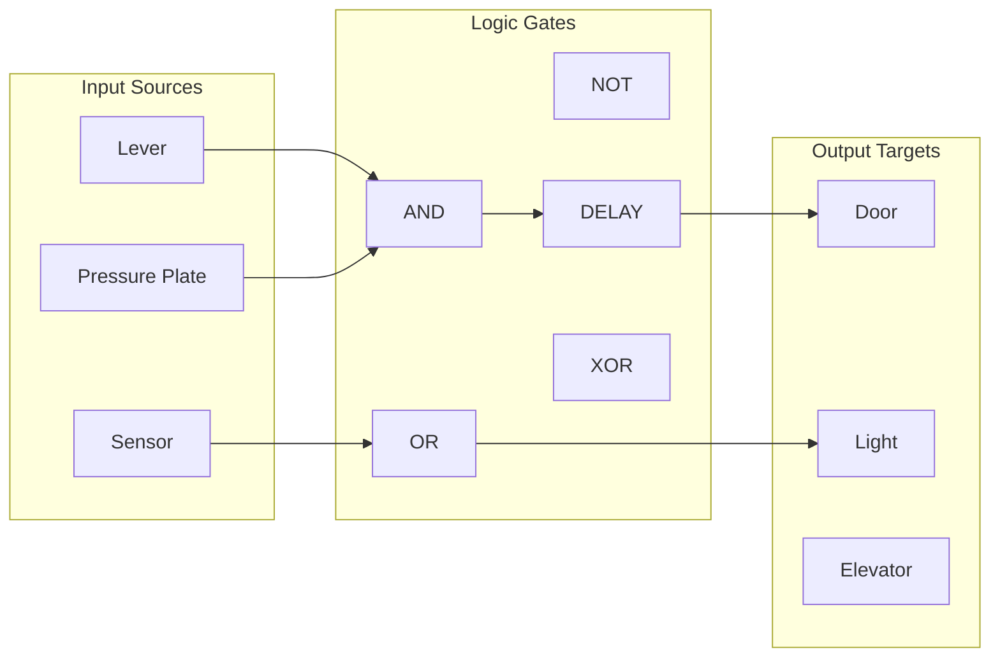
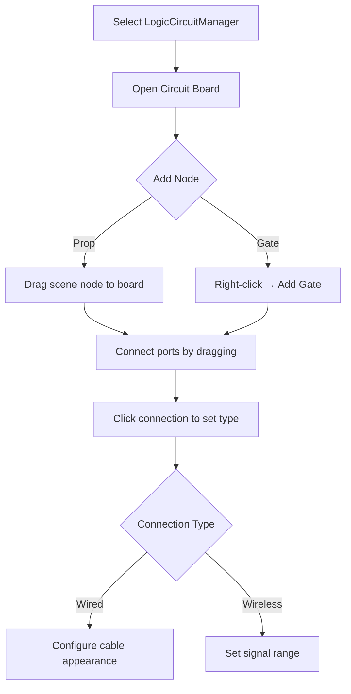
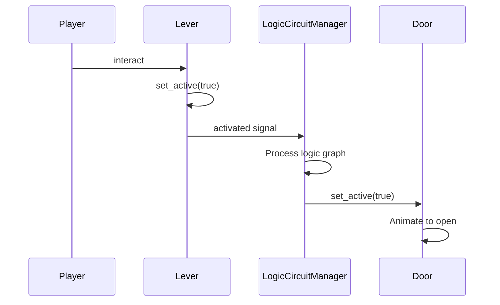

# Odyssey Logic Circuit System (OLCS)

A node-based visual scripting environment for defining logic connections between interactable objects.

## Overview

OLCS provides a visual editor similar to Godot's AnimationTree, allowing designers to create complex logic networks without writing code. It is **optional** - simple connections can use hierarchy linking instead.



## When to Use OLCS

| Scenario | Use OLCS? | Alternative |
|----------|-----------|-------------|
| Single lever → single door | No | Hierarchy linking |
| Button → multiple targets | Maybe | InteractableBridge |
| Pressure plate AND lever → door | Yes | - |
| Destructible cable connection | Yes | - |
| Wireless/remote control | Yes | - |
| Time-delayed activation | Yes | - |
| Complex logic (XOR, counters) | Yes | - |

## Core Components

### LogicCircuitManager

**Location:** `core_v2/systems/circuit/LogicCircuitManager.gd`

The runtime executor for circuit logic. Place one in your scene root.

```gdscript
# Required export
export(Resource) var circuit_data      # CircuitGraphResource
export(bool) var auto_build_cables     # Generate visual cables
export(PackedScene) var cable_scene    # Custom cable template
```

**Execution Model:**
- Tick-based propagation in `_physics_process`
- Prevents infinite loops via `MAX_LOGIC_STEPS` (100)
- Queue-based event system for DELAY gates

### CircuitGraphResource

**Location:** `core_v2/systems/circuit/CircuitGraphResource.gd`

Stores the circuit topology as a serializable resource.

```gdscript
# Data structure
var nodes: Dictionary      # { node_id: { type, scene_path, gate_type, position } }
var connections: Array     # [{ from, from_port, to, to_port, connection_type }]
```

### CircuitCable

**Location:** `core_v2/systems/circuit/CircuitCable.gd`

Procedurally generated visual cable with destructibility.

```gdscript
# Configuration
export(bool) var use_csg := false       # CSGPolygon (proto) vs ArrayMesh (production)
export(float) var cable_radius := 0.05
export(Material) var cable_material
export(float) var slack := 0.5          # Catenary curve tension
```

**Destructibility:**
- Contains `Hurtbox` area for damage detection
- Emits `connection_broken` when `health <= 0`
- Manager updates logic to treat connection as severed

## Visual Editor

### Activation

1. Enable plugin: Project Settings → Plugins → "Odyssey Logic Circuit Editor"
2. Add `LogicCircuitManager` node to scene
3. Create and assign a `CircuitGraphResource`
4. Select the manager → "Circuit Board" panel appears in bottom dock

### Node Types

#### Prop Node
Represents an `InteractableBaseV2` in the scene.

| Port | Color | Direction | Purpose |
|------|-------|-----------|---------|
| Input 0 | Green | In | `set_active(true)` |
| Input 1 | Green | In | `set_active(false)` |
| Output 0 | Red | Out | `activated` signal |
| Output 1 | Red | Out | `deactivated` signal |

#### Gate Node
Logic processing units.

| Gate | Inputs | Behavior |
|------|--------|----------|
| AND | 2+ | Output true if ALL inputs true |
| OR | 2+ | Output true if ANY input true |
| XOR | 2+ | Output true if ODD number true |
| NOT | 1 | Output inverted input |
| DELAY | 1 | Output delayed by `delay_time` |

### Connection Types

| Type | Visual | Destructible | Use Case |
|------|--------|--------------|----------|
| WIRED | Cable mesh | Yes | Physical connections |
| WIRELESS | Dashed line | No | Remote control |

### Editor Operations



## Runtime API

### Querying Circuit State

```gdscript
var manager = $LogicCircuitManager

# Check if a node is outputting
var is_active = manager.is_node_outputting("Lever_01")

# Get all connections for a node
var connections = manager.get_node_connections("Door_01")
```

### Dynamic Modification

```gdscript
# Break a connection at runtime
manager.circuit_data.disconnect_nodes("Lever_01", 0, "Door_01", 0)

# Add a new connection
manager.circuit_data.connect_nodes("Lever_02", 0, "Door_01", 0)

# Rebuild cables after modification
manager.generate_cables()
```

### Custom Cable Anchors

By default, cables connect to object origins. To specify anchor points:

1. Add a `Position3D` or `Spatial` child to your prop
2. Name it `CableAnchor`
3. OLCS will use this position instead

```gdscript
# In your prop scene
CableAnchor/Position3D  # Cable will attach here
```

## Integration with Interactables

OLCS automatically integrates with any `InteractableBaseV2`:



### No Code Required

For standard props, no additional code is needed. OLCS:
1. Listens for `activated`/`deactivated` signals
2. Propagates through logic graph
3. Calls `set_active()` on target nodes

### Custom Logic Nodes

For props with custom inputs/outputs:

```gdscript
# Prop with multiple outputs
class_name MultiOutputSwitch

signal output_a()
signal output_b()

func _on_special_action():
    emit_signal("output_a")
```

## Performance Considerations

| Aspect | Guidance |
|--------|----------|
| Node count | < 50 nodes per manager for real-time |
| Cable generation | Use `ArrayMesh` mode for production |
| DELAY gates | Each creates a queue entry |
| Wireless range | Keep < 100m for performance |

## Debugging

### Visual Debug

```gdscript
# Enable debug spheres at cable anchors
$LogicCircuitManager.show_debug_meshes = true
```

### Logic Trace

```gdscript
# In LogicCircuitManager
export(bool) var debug_logic := true  # Prints propagation trace
```

### Common Issues

| Issue | Cause | Solution |
|-------|-------|----------|
| Signal not propagating | Missing `activated` signal | Ensure source inherits `InteractableBaseV2` |
| Infinite loop warning | Circular logic | Add DELAY gate to break cycle |
| Cable not generating | Missing `cable_scene` | Assign or use default |
| Desync in replay | Logic in `_process` | Move to `_physics_process` |

## Future Enhancements

Planned features (see `docs/feature_odyssey_logic_circuit_system.md`):

1. **Property Inspection** - Edit gate properties in graph
2. **Obstacle Avoidance** - Cables route along walls/floors
3. **Signal Types** - Analog values beyond boolean
4. **Sub-circuits** - Nested circuit graphs
5. **Live Preview** - Test logic in editor without running
