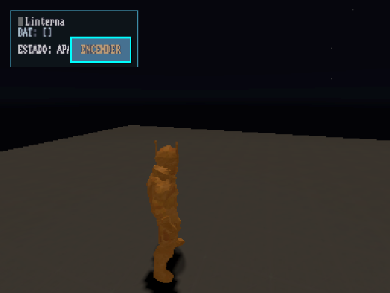
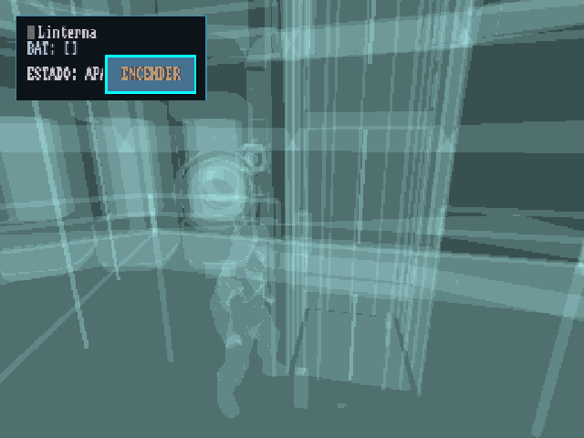

# Investigación: 3D pintado a medias en el Anbernic RG351V (Mali-G31, libmali)

**Estado al 2026-09-14 19:00:** causa aún sin confirmar. La hipótesis principal es que **el tiler del
G31 se satura por la carga de la escena por frame**. Panfrost no lo arregla, así que no es un bug
exclusivo de libmali. La escena simple
`TestScene_base.tscn` renderiza al 100% (milestone S0), así que el recorte depende de la complejidad
de la escena y no de la configuración de render.

Resultados crudos: tabla "Resultados" de [plan.md](plan.md). Historial de pruebas:
[HANDOFF_SIGUIENTE.md](HANDOFF_SIGUIENTE.md).

## Síntoma

- El HUD 2D sale completo. El 3D solo se ve en un bloque escalonado, con escalones alineados a
  tiles de Mali (16/32 px en espacio de render).
- El cielo con estrellas cubre la pantalla completa; la geometría opaca no.
- El screenshot del motor (readback) muestra el mismo recorte que `grim`: el render es parcial.
  No es un problema de presentación.
- A veces se repinta completo al mover la cámara.
- En la tabla, `dmesg` muestra ráfagas episódicas de `DATA_INVALID_FAULT` (0x58/0x5b) y un
  `Failed to map memory on GPU`. Entre ráfagas hay 0 faults y el recorte sigue igual.


## Descartado con evidencia

| Hipótesis | Prueba | Resultado |
|---|---|---|
| Runtime stock de PortMaster (Bullet) | proceso vivo y `strings` del binario | corre el FRT del fork con Box3D, v3.6.4-rc |
| MSAA 2x + FXAA | H1, dos veces | sin cambio en cobertura ni en memoria GPU |
| Framebuffer HDR, sombras 2048/PCF5 | H2+H3 con sufijo `.mobile` | −8k páginas GPU; la cobertura no cambia |
| Complejidad del fragment shader | `debug_draw` UNSHADED en vivo | mismo recorte |
| Lightmap manual del gate | H9: apagado | peor: magenta a pantalla completa (el lightmap nativo choca con las unidades de textura, §11.9) |
| Presentación, swap o damage parcial | traza de FRT y readback del motor | swap normal; el recorte ya está en el framebuffer |
| Flush forzado, CRC/TE off, IDVS (knobs del blob) | Sebastián | no cambian la cobertura |
| Muestreo de texturas en sí | S0 `TestScene_base` | el piloto texturizado y el piso se renderizan al 100% |
| Bug exclusivo de libmali (blob) | H6: Panfrost (Mesa), Sebastián | no se arregla con Panfrost; el problema no es propio del blob |

Nota sobre `0fa8d786` ("el aborto vive en el sampling"): la corrida de overdraw que cubrió el 100%
dibujó **la mitad de draw calls y vértices** (dc 97, vtx 176k contra dc 191-194 y vtx 304-321k).
Esa prueba no separa "sin texturas" de "menos geometría", y S0 la contradice: con texturas y poca
geometría se ve completo.

## Por qué FRT recibe la config "mobile"

- FRT expone el feature tag `mobile` (`frt_godot.cc:171`), no `Android`.
- Las GLOBAL_DEFS `.mobile` del motor y las claves `.mobile` de `project.godot` ganan sobre las
  claves planas (`project_settings.cpp:199-237`). Un `override.cfg` junto al `--main-pack`
  (`project_settings.cpp:391`) tiene que usar el sufijo `.mobile`.
- Config efectiva con el `override.cfg` actual: msaa 0, fxaa off, framebuffer 3, atlas y
  sombra direccional 1024, PCF0.
- Esto corrige la pre-exploración de `plan.md`, que suponía la config de escritorio (4096/PCF13).

## Hipótesis principal: saturación del tiler

### 1. La cobertura sigue a los vértices por frame

| Escena / corrida | vtx por frame | dc | Cobertura |
|---|---|---|---|
| Menú | 12k | 2 | OK |
| TestScene_base (S0) | bajo | — | **100%** |
| Dome_Prologue | 161-182k | 65-86 | intermitente, 85-100% |
| Dome_Intro, overdraw | 176k | 97 | **100%** |
| Dome_Intro, idle y debug | 280-420k | 125-194 | ~30% fijo |
| Dome_Prologue (h2h3) | 349k | 54 | recorte + magenta |
| Dome_Intro, carga | 597k | 175 | ~30% |

El umbral aparente está entre ~180k y ~280k vértices por frame, a 384×288.

### 2. El heap JIT del contexto no crece

Muestreo de `/sys/kernel/debug/mali0/ctx/<pid>_N/mem_jit_*` cada ~0,17 s, con Dome_Intro en pantalla:

```
cnt=0,4,0  vm=0,229376,0  phys=0,3954,0  used=0,0,0
(durante un job: phys=1977,1977,0  used=114688,0,0)
```

- Son 4 asignaciones JIT: dos de 57 344 páginas virtuales (224 MB) cada una, pero con **1977 páginas
  físicas (7,7 MB) fijas**. En 40 muestras nunca pasan de ahí.
- En Bifrost JM, el heap del tiler (listas de polígonos) es una región JIT que crece por page fault.
  Si no puede crecer, el driver descarta las listas de los tiles que faltan. Eso encaja con:
  - el borde escalonado por tiles;
  - el cielo completo: 2 triángulos grandes que caen en bins de nivel alto, asignados antes;
  - el repintado al mover la cámara: menos primitivas en la vista;
  - los `DATA_INVALID_FAULT` y el `Failed to map memory on GPU` esporádicos.
- Hay memoria libre (`MemAvailable` 130-310 MB), así que no parece un OOM del sistema.
- **Panfrost tampoco lo arregla.** Eso descarta un bug exclusivo del blob, pero no la saturación:
  Panfrost también usa un heap de tiler acotado y, en Bifrost, puede no soportar el render
  incremental cuando se llena. Si es saturación, es un límite del G31 con esta carga, común a los
  dos drivers, y la salida es bajar la carga por frame, no cambiar de driver. Sigue abierta la
  alternativa de que el disparador lo genere el motor (ver §3).
- `strings` de `libmali-bifrost-g31-g13p0-wayland-gbm.so`: aparecen `EVENT_MEM_GROWTH_FAILED` y
  `EVENT_TILE_RANGE_FAULT`. Las únicas variables de entorno son `MALI_PLATFORM_CONFIG`,
  `MALI_DEBUG_CONFIG` y `MALI_VERSION_INFO`, sin documentar. No se encontró un knob de tamaño del tiler.

### 3. Hipótesis alternativa que sigue viva

Que el disparador sea la **cantidad de materiales/programas o de texturas distintas** por frame
(descriptores de estado en la memoria del job), no los vértices. La escalera S1 separa las dos.

## Próximos pasos

1. **Escalera sintética S1** (en curso, `tools/gen_anbernic_ladder.py`, escenas inyectadas por PCK):
   - S1a: ~330k vtx, un material. Si se corta → vértices.
   - S1b: mismos vtx, un material por mesh. Si solo S1b se corta → cantidad de materiales.
   - S1c: S1b + texturas distintas. Si solo S1c se corta → texturas.
   - **Pendiente en el script:** la rama `s1c` todavía no asigna textura (genera lo mismo que `s1b`).
   - Agregar un **barrido de N** con el material de S1a (25k → 50k → 100k → 200k → 400k → 800k) para
     medir el umbral. Un control con los mismos vértices en triángulos grandes contra diminutos separa
     "vértices" de "primitivas por tile".
   - En cada punto registrar cobertura (grim), `mem_jit_phys` en ráfaga y faults.
2. **H7 render_scale:** si es saturación del tiler, 0.5 debería mejorar la cobertura y 1.0 empeorarla.
3. ~~H6 Panfrost~~: probado por Sebastián, no sirve (ver descartes).
4. **Mitigación, si se confirma la saturación:** presupuesto de primitivas visibles por debajo del
   umbral medido, en tier LOW:
   - `lowend_skip` sobre decoración;
   - `Camera.far`;
   - Rooms/Portals de Godot 3.6 para ocluir el domo por zonas;
   - `.mesh` decimados de criopods y scaffold (pipeline dome-bake).

## Cómo reproducir las mediciones

- Métricas y captura: `tools/anbernic_probe.sh <etiqueta> [segundos]`.
- Heap JIT en ráfaga (en el dispositivo, con el juego corriendo):

  ```sh
  C=$(ls -d /sys/kernel/debug/mali0/ctx/$(pidof godot.box3d.frt.arm64.debug odisea.frt.aarch64 | cut -d' ' -f1)_* | head -1)
  while :; do echo "$(cut -d' ' -f1 /proc/uptime) phys=$(cat $C/mem_jit_phys) used=$(cat $C/mem_jit_used)"; usleep 100000; done
  ```
- Estado del dispositivo y reglas: [HANDOFF_SIGUIENTE.md](HANDOFF_SIGUIENTE.md).



