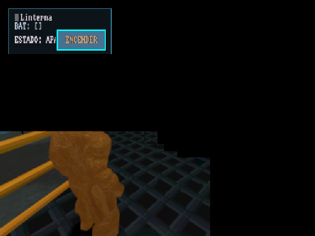

# Anbernic RG351V: 3D pintado a medias + low-end agresivo

**Estado:** Fase 0 pendiente. **Ejecuta:** Kilo. **Revisan:** Claude + Sebastián.
**Relacionado:** [FD-299](../../features/FD-299_render_tier_lowend.md), AGENTS.md §11.9 y §11.10.
**Brief para el agente:** [HANDOFF_KILO.md](HANDOFF_KILO.md).

## Problema

El port de PortMaster (nightly 602, commit `9e23a3f3`) arranca en el Anbernic RG351V
(`angel.local`, ROCKNIX, RK3326, Mali-G31, 1 GB de RAM, panel 640x480). El HUD 2D se ve
completo, pero el mundo 3D solo se pinta en un bloque de la esquina inferior izquierda, y
Dome_Intro corre a 2-3 fps.



## Pre-exploración (medida en vivo, 2026-09-14 14:10)

### Motor: nuestro fork, no el FRT de PortMaster

- Proceso vivo: `/roms/ports/odisea/odisea.frt.aarch64 --resolution 640x480 -f --video-driver GLES3 --main-pack odisea.pck`.
  El lanzador usa ese binario porque existe; el runtime `frt_3.6` no se monta.
- `strings` del binario: `Box3DPhysicsServer`, rutas `/home/runner/work/godot-box3d-3/...`, `3.6.4.rc.custom_build`.
- Log: `Godot Engine v3.6.4.rc.custom_build.6371881f6`, `OpenGL ES 3.0 Renderer: Mali-G31`,
  `[CollisionCullManager] Backend Box3D`, `[GLES3VendorGate] mali-g31: ambiente conservador + lightmap manual`.

### Causa directa: el GPU aborta el fragment job en cada frame

- `dmesg`: 730 faults `mali ff400000.gpu: job status 0x58 (DATA_INVALID_FAULT)` (y algunos `0x5b`),
  todos en job slot 0, dos por frame. Además un `Failed to map memory on GPU`.
- Los tiles que el driver procesó antes del fault se ven; el resto queda con el clear color. De ahí
  el borde escalonado de la captura: en espacio de render (384x288 = 640x480 × 0.6) los escalones caen
  en múltiplos de 16/32, que son tiles de Mali.
- Memoria: el contexto GPU del juego tiene **107 887 páginas ≈ 421 MB** (`/sys/kernel/debug/mali0/gpu_memory`).
  RSS del juego 694 MB, `MemAvailable` 58 MB, CMA libre 1 MB. EmulationStation sigue vivo con 96 MB.
- Telemetría: `fps 3, dc 175, obj 89, vtx 597 078, nodes 1757`. Dome_Intro tarda 84 s hasta `first_idle_frame`.

### Por qué: el Anbernic corre con la configuración de escritorio

El preset de export es `Linux/X11`, así que **ninguna clave `.Android` ni `.mobile` de `project.godot`
aplica en FRT**. Lo que recibe el G31:

| Setting | Valor efectivo en FRT | Contrato Android |
|---|---|---|
| `quality/filters/msaa` | 1 (MSAA 2x) + `use_fxaa=true` | 0 |
| `quality/intended_usage/framebuffer_allocation` | 2 (3D con efectos, HDR) | 3 |
| `quality/shadows/filter_mode` | 2 (PCF13) | 1 (`.mobile`) |
| `quality/shadow_atlas/size` / `directional_shadow/size` | 4096 / 4096 | 2048 / 2048 |
| `limits/rendering/max_lights_per_object` | 32 | 4 |
| `quality/filters/anisotropic_filter_level` | 4 | 1 |

- FD-299 dice que el atlas 2048 y las 4 luces "ya están en project.godot": **en FRT es falso**, son `.Android`.
- Los sistemas adaptativos existentes están apagados en FRT: `MobileLightBudget.gd:148`,
  `AdaptiveVisualBudget.gd:84` y `AdaptiveRenderScale.gd:187` se gatean con `OS.get_name() in ["Android","iOS"]`.
- `settings.cfg` del dispositivo: `render_scale=0.6`, `low_end_forced=true`.

### Palanca barata, verificada en el motor

`core/project_settings.cpp:391` (Godot 3.6 del fork) carga `override.cfg` desde el directorio del
`--main-pack`. El lanzador corre con `cwd = $GAMEDIR`, así que un `override.cfg` junto a `odisea.pck`
cambia settings de arranque (MSAA, framebuffer, sombras, vertex shading) **solo en PortMaster**, sin
tocar el `.pck` que comparten las otras plataformas ARM64.

### ¿Afecta a todos los RG351V?

Casi seguro sí, y a todo RK3326 con 1 GB y blob Mali en ROCKNIX (RG351P/M/V, R36S, R33S, RGB10,
ODROID Go2): la configuración de escritorio es determinista. Los H700 (RG35XX y compañía, mismo G31,
algunos con panfrost) quedan por verificar: el fault viene del blob, pero la presión de memoria es la
misma. La Fase 2 lo mide por telemetría en vez de suponerlo.

## Métrica objetivo

Todas las fases se miden igual. Por hipótesis: **reinicio limpio del juego** (§11.10: el estado GL no
se cambia en vivo), 60 s quieto en el spawn de Dome_Intro.

| Métrica | Cómo | Línea base (602) | Meta |
|---|---|---|---|
| GPU faults / 60 s | delta de `dmesg \| grep -c "GPU fault"` | ~260 | **0** |
| Memoria GPU | `/sys/kernel/debug/mali0/gpu_memory`, páginas del kctx grande | 107 887 | < 60 000 |
| MemAvailable | `/proc/meminfo` | 58 MB | > 150 MB |
| Cobertura 3D | captura `grim` | ~30% | 100% |
| fps / dc / vtx | heartbeat: `player.fps`, `perf.dc`, `perf.vtx` | 3 / 175 / 597k | ≥ 20 / < 120 / < 250k |
| Carga Dome_Intro | log `[SceneStartup] ... first_idle_frame` | 84 s | < 40 s |

Leer primero draw calls y memoria. La primera muestra de fps sale baja por warm-up de shaders:
comparar A/B/A, nunca A/B de fps.

## Fase 0 — Banco de medición (sin cambios en el juego)

1. `tools/anbernic_probe.sh [etiqueta] [segundos=60]`, script chico (~25 líneas), host en
   `PORTMASTER_HOST` (default `root@angel.local`):
   - cuenta faults antes y después de N s;
   - lee `gpu_memory` y `MemAvailable`;
   - saca `grim`, lo copia a `/tmp/odisea_probe/<etiqueta>.png` (≤ 640 px);
   - imprime el último heartbeat del central filtrado por `host == "Unix"` (fps, dc, vtx, escena);
   - agrega una línea TSV a `/tmp/odisea_probe/results.tsv`.
2. Línea base con el build 602 tal cual en **menú, Dome_Prologue y Dome_Intro**. Si el menú y Prologue no
   faultean, el problema es de volumen (memoria/geometría de Dome_Intro); si faultean, es de configuración global.
3. Modo debug (opcional, cuando haga falta `eval` o `render_info`): poner `godot.box3d.frt.arm64.debug` del
   release del fork (`.github/box3d_release`) como `odisea.frt.aarch64` y crear `ports/odisea/dev.sh` con
   `export ANNA_V2_BRIDGE=192.168.18.6:4999`. En release el central no permite screenshot; por eso la
   captura va por `grim`.

**Relanzar el juego:** siempre Sebastián desde ES. El relanzamiento por SSH **no funciona**
(aunque el proceso arranque, la ventana no aparece en pantalla; además `Odisea.sh` vive en
`/roms/ports/`, hermano del dir del port). Kilo prepara el estado (p. ej. `override.cfg`,
`dev.sh`) y pide el relanzamiento; `pkill` por SSH sí sirve para cerrar la instancia previa.

**Modo debug (en uso desde la Fase 0):** el launcher fuentea `odisea/dev.sh` (no viaja en el
paquete); ahí van `export ANNA_V2_BRIDGE=<ip_desktop>:4999`, `ANNA_V2_ALWAYS_STREAM=1` y
`ENGINE="$GAMEDIR/godot.box3d.frt.arm64.debug"` (release v0.2.7 del fork, respaldado como
`odisea.frt.aarch64.release`). Con el peer local de la desktop, el juego queda controlable
por `localhost:4999` (eval/goto_scene/screenshot). Las filas medidas en debug se marcan
como tal: el A/B por hipótesis se hace siempre con el mismo binario.

## Fase 1 — Causa raíz del 3D a medias

Todo vía `/storage/roms/ports/odisea/override.cfg` (formato de `project.godot`, sección `[rendering]`).
Confirmar que se cargó (binario debug + `ProjectSettings.get(...)`, o una línea en el log). Una hipótesis por
reinicio, acumulando lo que mejore:

- **H1 MSAA:** `quality/filters/msaa=0`, `quality/filters/use_fxaa=false`. Sospechoso principal
  (FBO multisample + resolve en el blob, y memoria).
- **H2 framebuffer:** `quality/intended_usage/framebuffer_allocation=3` (sin HDR ni buffers de efectos; ya es contrato en Android).
- **H3 sombras:** `quality/shadow_atlas/size=1024`, `quality/directional_shadow/size=1024`,
  `quality/shadows/filter_mode=0`. Si sigue, atlas en 0.
- **H4 RAM:** si H1-H3 bajan los faults pero no a 0, medir en una escena chica (InteriorLab) y anotar cuánto
  ocupa ES. No hay que "arreglar" ES todavía.
- **H5 si nada alcanza:** bisección por draw con el binario debug: `get_viewport().debug_draw = Viewport.DEBUG_DRAW_UNSHADED`,
  ocultar grupos (luces, criopods horneados, hielo/dither, lightmap manual con `ODISEA_MANUAL_LIGHTMAP=`) hasta
  aislar el draw que dispara `DATA_INVALID_FAULT`. Cada cambio de estado GL → reinicio.

**Checkpoint 1 (Sebastián):** captura con el 3D a pantalla completa y 0 faults en 60 s. Anotar el resultado en
la tabla de abajo y corregir AGENTS.md §11.10 con la causa real.

## Fase 2 — Mitigación en el paquete

1. `portmaster/override.cfg` (nuevo, tracked) con la combinación mínima de la Fase 1 más los settings de
   arranque de la Fase 3a que se validen.
2. `tools/build_portmaster.sh`: `install -m 644 "$SRC/override.cfg" "$OUT/$PORT/"` y una guarda
   `grep -q msaa` igual a los otros checks. `portmaster/Odisea.sh` no cambia (el cwd ya es `$GAMEDIR`).
3. Probar con `make portmaster-install` y después con el zip del siguiente nightly (`unzip -l` debe listar `odisea/override.cfg`).
4. **Alcance:** agregar a `render_diag` del heartbeat (donde ya se arman `video_driver` y `device_model`) los
   campos `adapter` (`VisualServer.get_video_adapter_name()`), `ram_mb` y `msaa`. Consultar el central por
   dispositivos `platform == "Unix"` con adapter Mali y reportar cuántos hay y de qué modelo. Si Sebastián
   consigue un H700 o un RK3566, repetir la Fase 0 ahí.

## Fase 3 — Low-end forzado agresivo (tier LOW de FD-299)

Regla: todo detrás del tier LOW (`GLES3VendorGate`: adapter `mali-g31` verificado, o `low_end_forced`).
Desktop, Android e iOS no cambian. No crear sistemas nuevos: extender los que existen. Medir cada paso.

**3a. Settings de arranque** (van al `override.cfg` del port; no se pueden cambiar en runtime):
`quality/shading/force_vertex_shading=true`, `quality/shading/force_lambert_over_burley=true`,
`quality/shading/force_blinn_over_ggx=true`, `quality/filters/anisotropic_filter_level=0`,
`limits/rendering/max_lights_per_object=4`, `quality/reflections/texture_array_reflections=false`,
`quality/depth/hdr=false`. Medir por bloque; vertex shading cambia el look (captura para Sebastián).

**3b. Runtime en `core_v2/autoloads/GLES3VendorGate.gd`** (ya engancha `node_added`):
- Exponer `is_low_tier()` (hoy es `_gated_active or force_gate or _user_forced_low_end()`).
- En `_on_node_added`:
  - `Light` → `shadow_enabled = false`;
  - `GeometryInstance` → `cast_shadow = SHADOW_CASTING_SETTING_OFF`;
  - `SpatialMaterial` de `MeshInstance` → apagar normal map, rim, clearcoat, anisotropía, AO, depth/parallax y
    subsurface, y `flags_vertex_lighting = true`. Es mutación en memoria de recursos compartidos: nunca `ResourceSaver`.
  - Los `ShaderMaterial` propios (hielo, dither) se dejan.
- Nodos del grupo `lowend_skip` → `queue_free()` (nunca subtrees con colisión o gameplay).

**3c. Presupuestos existentes:** el gate `OS.get_name() in ["Android","iOS"]` de `MobileLightBudget`,
`AdaptiveVisualBudget` y `AdaptiveRenderScale` pasa a incluir el tier LOW (una condición, leyendo
`GLES3VendorGate`). Verificar que `AdaptiveRenderScale` no provoque realocación de framebuffer con faults;
si la provoca, piso fijo 0.5 y sin adaptación.

**3d. Geometría (vtx 597k → < 250k).** Godot 3.6 no implementa `lod_min/max_distance` en `GeometryInstance`
(confirmarlo en el fork antes de descartarlo). Orden, midiendo `perf.vtx` y `dc`:
1. `Camera.far` más corto en tier LOW (el domo tiene radio ~33 m).
2. Marcar con `lowend_skip` la decoración cosmética de Dome_Intro/Dome_Base (sin tocar criopods ni pasarelas con colisión).
3. Si no alcanza: proponer a Sebastián variantes decimadas de los `.mesh` más pesados (pipeline dome-bake).
   **No** reserializar `.tscn` grandes (`pack()` borra overrides).

**3e. Texturas/VRAM:** medir cuánto baja la memoria GPU con 3a-3d antes de tocar texturas. Si hace falta,
evaluar un `.pck` de PortMaster con texturas a la mitad (solo en el job de PortMaster de `export_all.yml`).
Decide Sebastián.

**Checkpoint 2 (Sebastián):** Dome_Intro ≥ 20 fps, 0 faults, captura aceptada estéticamente.

## Fase 4 — Pendientes de FD-299 que tocan la experiencia

Solo si las Fases 1-3 cierran: pantalla de carga visible durante toda la carga de Dome_Intro, y actualizar
FD-299 (tabla de tiers, corregir lo del atlas 2048/4 luces, sección "Mitigación en PortMaster").

## Verificación final

- `tools/anbernic_probe.sh final` en menú, Prologue y Dome_Intro: 0 faults, 3D completo, metas cumplidas.
- Tests puntuales de lo tocado (gate y budgets), por pytest/GdUnit; nunca la suite completa en local.
- Desktop sin regresión: captura del domo antes/después con `tools/launch_game.sh`.
- CI: el zip del nightly trae `odisea/override.cfg`.

## Resultados

Una fila por corrida. Capturas en `/tmp/odisea_probe/`; copiar aquí solo las de los checkpoints.

| Etiqueta | Build / cambio | Escena | Faults/60 s | Páginas GPU | MemAvail MB | fps | dc | vtx | Cobertura 3D | Nota |
|---|---|---|---|---|---|---|---|---|---|---|
| baseline-602 | nightly 602, sin override | Dome_Intro | ~260 | 107 887 | 58 | 3 | 175 | 597 078 | ~30% | captura arriba |
| baseline602_dome_intro_idle | nightly 602, sin override | Dome_Intro (idle, carga caliente) | **0** | 107 797 | 40 | 1 | 125 | 418 446 | ~30% | misma cobertura rota; el fault spam es de la fase de carga y se detiene solo (ver nota) |
| baseline602_menu_debug | 602 + binario debug v0.2.7 | Menu | 0 | 57 262 | 407 | 23 | 2 | 12 350 | OK (2D) | debug corre a ~mitad del release (42 fps) |
| baseline602_prologue_debug | 602 + binario debug v0.2.7 | Dome_Prologue | 0 | 70 383 | 315 | 5 | 65 | 182 184 | ~85-100% intermitente | Sebastián: "a veces pinta todo, casi siempre solo la esquina"; captura casi completa |
| baseline602_dome_intro_debug | 602 + binario debug v0.2.7 | Dome_Intro | 0 (la ráfaga llegó después, idle) | 90 493 | 133 | 2 | 186 | 281 994 | ~30% | ANNA screenshot (readback del motor) = mismo recorte → el render es parcial, no la presentación |
| h1_msaa_menu | H1: msaa=0, fxaa=off | Menu | 0 | 53 628 | 387 | 24 | 2 | 12 350 | OK (2D) | override verificado via eval (msaa=0) |
| h1_msaa_prologue | H1: msaa=0, fxaa=off | Dome_Prologue | 0 | 69 154 | 290 | 5 | 86 | 161 352 | intermitente | igual que baseline debug |
| h1_msaa_dome_intro | H1: msaa=0, fxaa=off | Dome_Intro | 0 | 91 573 | 106 | 2 | 194 | 321 402 | **~30% (sin cambio)** | H1 no mejora cobertura ni memoria GPU (91.5k vs 90.5k págs) |
| h2h3_menu | H2+H3 `.mobile` (fb 3, sombras 1024/PCF0) | Menu | 0 | 48 934 | 378 | 29 | 2 | 12 350 | OK (2D) | −8k págs y +5 fps vs H1 en menú |
| h2h3_prologue | H2+H3 `.mobile` | Dome_Prologue | 0 | 61 700 | 320 | 5 | 54 | 349 326 | parches **magenta** + recorte | falla nueva: magenta = sampler sin bindear; la config sí cambió el camino de render |
| h2h3_dome_intro | H2+H3 `.mobile` | Dome_Intro | 0 | 82 886 | 134 | 2 | 194 | 321 402 | **~30% (sin cambio)** | −8k págs vs baseline; la cobertura no cede |
| h5a_unshaded_live | debug_draw=1 en vivo, Dome_Intro cargado | Dome_Intro | 0 (10 s) | 81 989 | 146 | 2 | 194 | 321 402 | mismo recorte + magenta | el shader trivial no completa la cobertura → no es complejidad de fragment shader; test limpio desde boot pendiente (ver HANDOFF_SIGUIENTE.md) |
| bisect_overdraw | debug_draw=2 (OVERDRAW) en vivo | Dome_Intro | 0 (5 s) | 83 675 | 188 | 2 | 97 | 176 412 | **100%** | el shader de debug del motor (sin texturas/luces) rasteriza TODO: el aborto vive solo en el camino de materiales que muestrea texturas |
| bisect_albedo_white | material_override blanco unshaded (propagate_call interrumpido) | Dome_Intro | 0 (5 s) | 83 770 | 214 | 2 | 191 | 304 446 | geom. visible aún texturizada | el override no llegó a los meshes visibles; repetir con verificación por nodo |
| h9_native_lightmap_dome_intro | reboot propio + lightmap manual OFF (gate congelado) | Dome_Intro | 0 (60 s) | 83 398 | 280 | 3 | 194 | 321 402 | **magenta a pantalla completa** | Sebastián: "intermitente azul por un rato" (clear color en carga) → sin manual, el nativo colisiona unidades (§11.9) y todo muestrea sin bind |
| s0_testscene_base | TestScene_base: CSGBox+Pilot+1 luz dir+shadows+ExteriorSpace (via PCK) | TestScene_base | 0 (15 s) | 67 909 | 254 | 4 | 8 | 25 428 | **100%** | primer rung verde del bisect |
| s1a_ladder | +80 esferas (~165k vtx), 1 material PBR texturado | LadderS1a | 0 (10 s) | 64 401 | 250 | 3 | 156 | 1 860 024 | **100%** | draw count y vtx no disparan el aborto |
| s1b_ladder | 80 materiales distintos sin textura | LadderS1b | 0 (10 s) | 62 357 | 237 | 2 | 138 | 1 647 828 | **100%** | la variedad de materiales no dispara el aborto |
| s1d_ladder | 80 materiales + 56 texturas distintas | LadderS1d | 0 (10 s) | 63 021 | 393 | 5 | 138 | 1 647 828 | **100%** | primera generación referenciaba kenney green/red (excluidas del pack) → CANT_OPEN 19 y juego colgado; regenerado con pool filtrado |
| s2a_ladder_domeenv | S1d + Environment_DomeIntro | LadderS2a | 0 | 65 727 | 196 | 2 | 141 | 1 672 644 | **100% sostenida** (serie×4 con movimiento) | el env del domo (con gate strip) no dispara el aborto |
| s3_ladder_lightmap | S1d + ShaderMaterial lightmap_manual (UV2) por mesh | LadderS3 | 0 | 65 819 | 189 | 2 | 119 | 1 410 708 | **100%** | el camino del lightmap manual no dispara el aborto |
| level_Dome_01 | nivel real del pack | Dome_01 | 0 (8 s) | 47 949 | 340 | 4 | 24 | 30 012 | 1 frame lleno y luego falla | Sebastián: "es mentira, solo tuvo un frame completo" → capturas aisladas mienten, series obligatorias |
| level_Dome_Crio | nivel real del pack | Dome_Crio | 0 (8 s) | 47 449 | 334 | 3 | 245 | 89 037 | bloques púrpura + estrellas | tiles abortados conservan contenido previo: el púrpura es el cielo de Dome_01 (stale) |
| level_Dome_Base | nivel real del pack | Dome_Base | 0 (8 s) | 61 292 | 330 | 3 | 86 | 122 046 | negro total | |
| dome_v2_test | **PR #347: domo paramétrico V2** (bake 4 superficies + 4 airlocks + SpawnPointV2) | DomeDefaultV2Test | 0 (serie 15 s) | 50 761 | 349 | 5 (release por medir) | 44 | 48 948 | **100% sostenida (serie×4 + movimiento)** | contexto GPU mínimo de la sesión (~198 MB); el player spawnea en (0,1,8) — integración V2 viable para low-end |

### Matriz limpia de reboots (domo V2 integrado, sin cajas, audio Dummy, física 30Hz)

| Run | Binario | Escena | fps | dc | vtx | Cobertura (serie) | Págs GPU | Nota |
|---|---|---|---|---|---|---|---|---|
| R1 | debug | Dome_Default (boot directo) | 6-7 | 25 | 32 664 | 100% | 34 708 | capturas dome_default_v2_noboxes2_* |
| R2 | **release** | Dome_Default (boot directo) | **8-9** | 25 | 32 664 | 100% | 34 343 | captura R2_release_dome_v2.png; 543 MB libres |
| R3 | release | Dome_Intro via menú (**asset viejo**) | **3-4** | 69 | 180 420 | **~75%, banda derecha negra** + transparencias que no terminan de dibujar (Sebastián) | 82 763 | 235 MB libres; el asset viejo es 2.5× más lento y rompe cobertura con contenido mínimo comparable |

- El pipeline 3D del blob ya no es el cuello de cobertura: 25 draws renderizan completos.
- La brecha a 20 fps es main-thread (~110 ms/frame no-GPU, no tracked por el engine);
  el audio va por Dummy (pipewire fuera del camino del juego — mejoró la reactividad).
- Sebastián observó que los artefactos de tiles retornaron en una corrida CALIENTE con
  transiciones encadenadas: tras reboots limpios no se han visto en R1/R2. Protocolo:
  una medición por reboot, transiciones encadenadas solo como prueba de estrés.
- **Conclusión de la matriz: el asset viejo del domo es el problema de fps y de cobertura;
  el V2 (PR #347) los resuelve.** Dome_Intro/Prologue/Base quedan lentos hasta migrar
  (requiere re-hornear lightmaps — seguimiento aparte según el propio PR).

### Descubrimiento de protocolo: tiles abortados = contenido stale

Los tiles cuyo fragment job aborta NO muestran clear color: conservan lo último escrito ahí
(cielo de frames previos, contenido del nivel anterior, magenta del sentinel de textura sin
bind de Mali). Por eso las capturas aisladas mienten y el patrón "cambia" entre corridas.
Protocolo: serie de 4 shots con rotación de yaw entre shots (`ANNA_MOVE=1`), audio muteado
(`AudioServer.set_bus_mute(0,true)`), y la métrica es cobertura SOSTENIDA.

### Estado del bisect (escalera de features, todas vía PCK con push_scene_pck.sh)

Funciona 100% en el blob: escena base + 80 draws + 165k vtx + 1 material texturado PBR;
80 materiales distintos; 56 texturas distintas; Environment_DomeIntro; ShaderMaterial del
lightmap manual. Rompe: TODOS los niveles reales del domo (Dome_01 con solo 24 draws rompe).
La diferencia restante está en los assets/mallas horneadas del domo viejo (Qodot/DomeTerrace)
o su arquitectura de escena — no en los caminos de render probados. El domo paramétrico V2
(PR #347) reemplaza exactamente ese asset y renderiza 100%: la integración es además la
solución del bug.

### Perfil de performance (sesión de optimización, binario debug salvo donde se indica)

- **La cobertura 3D está RESUELTA** con domo V2 + settings lowend: 0 faults sostenidos en
  Dome_Default y DomeDefaultV2Test. El problema restante es puro fps: **2-7 fps en TODA
  escena 3D cargada por sesión** (incluso TestScene_base con 8 draws: 4 fps), mientras el
  menú corre a 45 y un árbol liberado con cámara+quad+20 esferas+cielo corre a 44-120.
- GPU dvfs instantáneo: **8% busy** — no es GPU. Main thread: 97% de un core A35, wchan=0
  (computa/spinnea en userspace). TIME_PROCESS 38 ms + TIME_PHYSICS 30 ms (debug) de
  ~160-300 ms de frame: **~90-200 ms por frame quedan fuera de los monitores del engine**.
- Bisect por liberación (eval en vivo): liberar el PILOT COMPLETO → 48 fps. Liberar sus
  subtrees por separado (Logic, Visual, CollisionShape, AudioListener), apagar el
  PhysicsServer, matar callbacks de current_scene, matar 7 autoloads, apagar el rig
  VCameraSystem: **ninguno reproduce la recuperación por separado**. Hay interacción entre
  el pilot y el flujo de sesión que solo el pause/free completo corta (pausa del árbol: 26 fps).
- Descartes con medición: cajas del experimento (63 PushableBox removidas del nivel),
  física 30Hz (activa), audio muteado, VCameraSystem process, autoloads de presupuesto.
- La pista dura: **el costo existe solo cuando la sesión/gameScene está montada**; el mismo
  contenido en un árbol sin sesión corre rápido. El paso siguiente es perfilar el frame
  completo en device (perf o reloj por segmentos en el fork), no más bisect a ciegas.

### Resultado integración domo V2 (PR #347)

- Dome_Default con DomeTerraceV2_baked (4 superficies) + 4 airlocks + SpawnPointV2 en
  (0,1,8): **cobertura 100% sostenida** (series con movimiento, audio mudo), 0 faults,
  contexto GPU mínimo de la sesión (~195 MB), MemAvailable hasta 526 MB.
- El experimento de cajas pushables fue removido del nivel (63 instancias — no es tier:
  Sebastián lo ordenó; el experimento no pertenece al nivel).

### Descartes de Sebastián (knobs del blob, con evidencia temporal)

- flush forzado (12 s, oscila parcial/casi vacío, 4 fps) — descartado y revertido.
- Traza FRT: SDL llama eglSwapBuffers normal, sin swap/damage parcial → no es presentación.
- far=10 (culling agresivo): el movimiento real no logra redraw sostenido — descartado, cámara en 10000.
- CRC/Transaction Elimination OFF: la serie parte peor y estabiliza en el mismo recorte.
- IDVS: no cambia cobertura ni fps.
- Conclusión suya: "no queda un toggle de runtime honesto"; iteración ahora posible con autostart
  de ES + reboot (Kilo puede reiniciar por SSH).
- Hipótesis de Sebastián: bug de libmali disparado por la carga/sampling de texturas (el juego
  corría bien al inicio del ciclo, sin las formas y texturas complejas). El test overdraw la
  sostiene: sin sampling hay 100% de cobertura.

### Notas de medición (Fase 0)

- El ring de dmesg rota (~1463 líneas, se llena de faults durante la carga): contar por
  delta de `grep -c` da subconteos e incluso negativos. `anbernic_probe.sh` cuenta por
  timestamp kernel contra `/proc/uptime`.
- El fault spam no es estrictamente de carga: llega en ráfagas (durante la carga en
  release; en idle a los minutos en debug). Entre ráfagas hay 0 faults con la cobertura
  igual de rota.
- El contexto GPU del kernel (~353-421 MB) es ~6× el VRAM que reporta Godot (71.7 MB en
  Dome_Intro, 10.3 MB en menú): ~350 MB son buffers del driver invisibles en `vrammb`.
- **H1 (msaa=0 + fxaa=off) no cambia nada** (probado 2×): cobertura igual de rota y págs GPU
  idénticas (91 573 vs 90 493). El MSAA del FBO no es el consumidor de memoria ni la causa.
- **Descubrimiento clave del fork:** FRT expone el feature tag **"mobile"** (`frt_godot.cc:171`:
  X11, FRT, mobile, etc — "Android" NO). El motor registra GLOBAL_DEFS taggeadas `.mobile`
  (`visual_server.cpp:2678-2711`) y el mapeo `feature_overrides` (`project_settings.cpp:199-237`)
  hace que `_get()` resuelva al valor taggeado aunque el override haya seteado la clave plana.
  **El override.cfg debe usar sufijo `.mobile`.**
- **Corrección a la pre-exploración:** el Anbernic NO corre 4096/PCF13. Config efectiva hoy:
  shadow atlas 2048 + directional 2048 + PCF5 + framebuffer HDR (project.godot pisa
  `framebuffer_allocation.mobile` a 2; el default del fork es 3) + `force_vertex_shading.mobile=false`
  (project.godot pisa el default true del fork) + 32 luces (`.Android=4` no aplica).
- La corrida "H2+H3" con claves planas fue en la práctica solo H1 otra vez (sombras/HDR no
  aplicaron: leídas 2048/2048/PCF5/HDR vía eval). Re-testeada con sufijo `.mobile`.
- **H2/H3 combinadas en un solo reinicio** (aprobado por Sebastián en Checkpoint 1): cada test
  cuesta un relanzamiento manual; si la combinación mejora, bisecar después con un reinicio más.
- Corridas: TSV vivo en `/tmp/odisea_probe/results.tsv`; capturas junto a cada fila.

## Noche 2026-09-15 — nightly 604 (domo V2 + fork v0.3.0) en el Anbernic

Protocolo nuevo, más confiable que las capturas sueltas:
- **Entrar a Dome_Intro por `SceneManager.goto_scene` desde Dome_Default**, no con
  `run/main_scene=Dome_Intro`. Arrancando directo en el nivel, `IOSLightmapFallback` corre su
  `_ready` antes de que el gate sincronice `ODISEA_MANUAL_LIGHTMAP` y el nivel sale **magenta
  entero** (artefacto del arranque, no lo ve un jugador que entra por el menú).
- **Cobertura = cámara propia + 2 capturas con 0.4 m de jitter**: un píxel que no cambia entre
  capturas es un tile viejo. La imagen puede quedar congelada entera durante minutos: la
  cámara del jugador y `player.yaw` no sirven para comparar vistas.
- `/eval` rechaza `;` incluso dentro de strings y corta en 512 caracteres.
- En ROCKNIX `paste` no es coreutils: sube el texto a un pastebin. No usarlo en el device.

### Fps: el problema era el tick de física, no el render

Perfil por sistema en vivo (`PerformanceMonitor.perfil_corrida_iniciar()` por eval, binario
debug v0.3.0, Dome_Intro):

| Corrida | fps | ticks/s | ticks/frame | scripts/tick |
|---|---|---|---|---|
| R4 nightly 604 (release), Dome_Default | 17-19 | 60 Hz | — | — |
| R5 nightly 604, Dome_Intro | 4 | 32 de 60 (54% tiempo real) | 8 (tope) | 17.8 ms |
| sin ningún script de física | 18.2 | 60 | 3.3 | 0 (servidor Box3D ~4 ms) |
| R6 30 Hz real + animator espaciado | 6.4 | 30 de 30 | 4.7 | 16.2 ms |
| **R7** + sistemas ambientales espaciados, **Dome_Default** | **27.1** | 30 de 30 | 1.1 | 8.2 ms |
| R7, Dome_Intro (render parcial, fps optimista) | 15.2 | 30 de 30 | 2.0 | 15.0 ms |
| **R8 mismo build, binario release**, Dome_Default | **28** | 30 Hz | — | — |

- Espiral: con 17.8 ms de GDScript por tick y período de 16.7 ms, cada frame arrastra 8 ticks
  (tope fijo en `main.cpp`; `physics/common/max_physics_steps_per_frame` **no existe** en 3.6).
- La clave de física del `override.cfg` estaba mal (`physics/common/physics_fps` dentro de
  `[physics]`): el motor seguía a 60 Hz. "Física 30Hz (activa)" de arriba nunca se aplicó.
- Reparto del tick: PlayerControllerV2 6.9 (animator 2.7 de eso), PipeCoolantRun 22× 2.0,
  Room3D 1.3, CoolantFlowAdapter 1.2, HoloTerminalV2 0.95, SuitOSContextDriver 0.7,
  Interactables 0.74, KinematicArm3D 0.62, IceLevel 0.5, ShipSystemBus 0.4.
- Sin efecto medible al apagarlos en vivo: AudioStreamPlayer3D (80), CPUParticles (47),
  Tween (43), Viewports secundarios (4), ReflectionProbe.

### Cobertura de Dome_Intro: sigue rota con el domo V2

- El V2 **no** arregla Dome_Intro: la vista del hub (208 draws, 850k vtx) aborta tiles; la del
  airlock (25 draws, 232k vtx) sale completa, en la misma sesión.
- `dmesg`: "Failed to map memory on GPU" + `DATA_INVALID_FAULT` en ráfagas. Contexto GPU
  83-95k páginas (Dome_Default 55k), CmaFree ~0 en ambos niveles (el CMA no discrimina).
  MemAvailable 164-326 MB: tampoco es RAM general.
- Aislado a una malla: con **solo TerraceFloor** en pantalla (2 draws) la vista del hub rompe con
  sus materiales de `IOSLightmapFallback`, y renderiza completa con cualquier material único para
  las dos superficies (incluido el mismo `lightmap_manual.shader` con la misma textura
  2100×2148 y los mismos parámetros como override). Rompe la combinación de dos materiales
  manuales distintos en la misma malla; la carcasa con dos materiales manuales no rompe.
- Con la escena completa, arreglar el piso no alcanza, y sacar TODO el lightmap manual tampoco:
  hay más disparadores. Subdividir el piso (triángulos de 30 m) no cambia nada.
- Descartados: `shader_compilation_mode.mobile=0` (−6k páginas, sigue rota),
  `quality/reflections/atlas_size=0` (−4..12k páginas, sigue rota), luminarias de pared
  (`FixtureBatch_*`, 96k índices c/u, las re-muestra `LightPathV2` cada 0.25 s: ocultarlas a mano
  no dura), pantallas con ViewportTexture, `SCREEN_TEXTURE`/`DEPTH_TEXTURE`.
- La DirectionalLight visible con sombra es intencional (bf7eb637); apagar su sombra da +8% en
  la vista del hub y ocultarla −33 draws. `verify_dome_intro_contract.gd` pide lo contrario.

### Pendiente para decidir (Sebastián)

1. Presupuesto de contenido del tier LOW para Dome_Intro (qué recortar u ofrecer como LOD).
2. ~~`cma=` más grande~~ **Probado (L12, aprobado por Sebastián):** `cma=128M` en `/flash/boot.ini`
   ("cma: Reserved 128 MiB"): la vista del hub sigue rota y "Failed to map" sigue subiendo. El
   kernel presta el CMA a memoria movible, así que CmaFree≈0 no indicaba falta de contiguo para
   el driver. boot.ini restaurado al original.
3. Espaciar en tier LOW el escaneo de interacción y de zonas del player (hoy por tick, a propósito).

## Driver del Mali: causa de la cobertura rota (2026-09-15)

Pila del dispositivo (ROCKNIX **20250517**): kernel 6.12.17, `mali_kbase` **r52p0** (UK 11.49),
userspace `libmali-bifrost-g31-`**`g13p0`** + `libmali-hook`. Mali-G31 r0p0, **VA de GPU de 33 bits** (8 GB).

Cómo se vio (sin kprobes/ftrace en ese kernel; sí `CONFIG_DYNAMIC_DEBUG`):

```sh
echo "file mali_kbase_reg_track.c +p" > /sys/kernel/debug/dynamic_debug/control   # -p para apagar
dmesg | grep "suitable region"
cat /sys/kernel/debug/mali0/ctx/<pid>_1/{mem_zones,mem_jit_count,mem_jit_vm,mem_allocs}
```

- "Failed to map memory on GPU" sale de `kbase_mem_alloc` → `kbase_gpu_mmap` →
  `kbase_add_va_region_rbtree`: **"Failed to find a suitable region: 94208 nr_pages"** (dev_dbg, invisible
  por defecto). No es RAM ni CMA: es **espacio de VA**.
- Zonas del contexto del juego: SAME_VA 6.75 GB, **CUSTOM_VA (JIT) 1 GB**, EXEC_VA 256 MB.
- En la zona JIT: 16×8 MB + 2×80 MB + **1×368 MB** (heap del tiler con 2.4 MB comprometidos) = 656 MB
  (`mem_jit_vm` pico 167936 págs). Huecos libres de 80/80/208 MB: el **segundo heap de 368 MB que g13p0
  pide cada frame nunca entra**. Pasa también en Dome_Default (que sí renderiza); en Dome_Intro, con más
  trabajo de tiler por frame, termina en `DATA_INVALID_FAULT` y tiles abortados.
- `libmali` no expone perillas de JIT/heap (solo `MALI_DEBUG_CONFIG`/`MALI_PLATFORM_CONFIG` con claves internas).

### Por dónde optimizar (de menor a mayor esfuerzo)

1. **Actualizar ROCKNIX** (20260901): RK3326 pasó a `libmali` **g29p1** (JeffyCN, PR #3008, 2026-08) y kbase
   r54p2. Un userspace 16 versiones más nuevo puede dimensionar el heap del tiler / JIT distinto. Sin tocar
   el juego; repetir L1 (vista del hub con cámara propia) tras actualizar.
2. **Panfrost** (Mesa) ya se probó y se congelaba (ver arriba); con Mesa más nuevo en ROCKNIX actual podría
   valer otra prueba: no usa JIT de kbase.
3. **Parche de kbase**: agrandar la zona JIT en `kbase_region_tracker_init_jit` (p. ej. forzar ≥ 4 GB; el juego
   usa < 1 GB de SAME_VA). Requiere compilar `mali_kbase.ko` para el kernel exacto de ROCKNIX y distribuirlo:
   solo para prueba de causa o para proponer upstream a ROCKNIX.
4. **Del lado del juego** (mitiga, no arregla): menos trabajo de tiler por frame en vistas pesadas (primitivas que
   cubren muchos tiles, draws), que es lo que convierte el fallo del segundo heap en tiles abortados.

### L13 — ROCKNIX 20260901 lo resuelve (2026-09-15)

Actualizado a ROCKNIX 20260901 (`next`, kernel 7.1.2, `mali_kbase` **r54p2**, `libmali` **g29p1**).
Nota: el RG351V tenía dos SD; la de juegos (128 GB, partición exFAT de ArkOS) arrancó un ArkOS viejo al
aplicar la actualización. Arrancar solo con la de 8 GB (ROCKNIX) la completó. Además `/storage/.cache/cores`
tenía 3.9 GB de core dumps de Odisea que impedían descargar la actualización.

| | ROCKNIX 20250517 (g13p0) | ROCKNIX 20260901 (g29p1) |
|---|---|---|
| Zona CUSTOM_VA (JIT) | 1 GB, llena por heaps de 368 MB | **no existe** (todo SAME_VA) |
| mem_jit_count / mem_jit_vm | pico 19 / 656 MB | **0 / 0** |
| Faults / "Failed to map" | cientos | **0 / 0** |
| Vista hub de Dome_Intro (cámara propia, 208 draws, 850k vtx) | 7% celdas frescas (rota) | **91% (completa)** |
| Dome_Intro, cámara del jugador, binario debug | 4 fps (render parcial) | **10.7 fps**, 30/30 ticks |
| MemAvailable en Dome_Default | 164-326 MB | 448 MB |
| **R9 Dome_Intro, binario release, entrando por el menú** | 4 fps, 30% cobertura | **12 fps, cobertura completa** (serie ×4), 0 faults, 99 dc, 194k vtx |

Consecuencia para PortMaster: en ROCKNIX < 20260901 (libmali g13p0) y otros CFW con blobs viejos Dome_Intro
va a verse cortado; vale avisarlo en el README del port. **L14 — lightmap nativo con g29p1 (probado):** con `_manual_lightmap_synced=true` antes de cargar Dome_Intro, el
fallback se libera y queda el lightmap del motor. Ya **no sale magenta** (el blob nuevo arregló la colisión de
unidad), cobertura buena (hub 76%, casquete 94%, 0 faults), pero **peor en todo lo demás**: 7.9 fps contra 10.7 del
manual (debug, cámara del jugador), MemAvailable 132 MB contra ~250 MB, y el **piso del domo pierde su lightmap**
(casi negro; el vínculo de BakedLightmapData con la malla local_to_scene). Se queda el camino manual.
