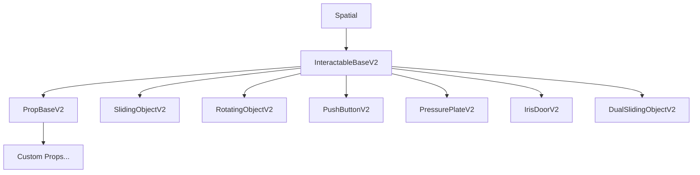
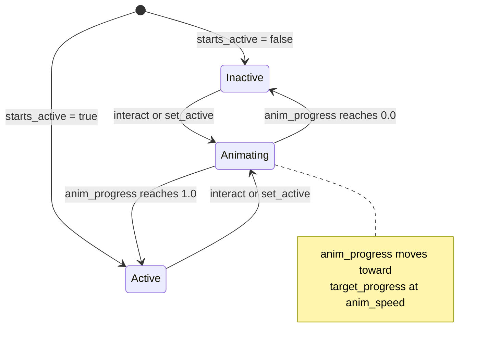

# InteractableBaseV2 Technical Contract

The foundational specification for all deterministic interactive objects in Odisea.

## Class Hierarchy



## Core State Machine

Every InteractableBaseV2 manages state through three key variables:

| Variable | Type | Range | Purpose |
|----------|------|-------|---------|
| `is_active` | bool | true/false | Logical state (open/closed, on/off) |
| `anim_progress` | float | 0.0 - 1.0 | Current visual position |
| `target_progress` | float | 0.0 - 1.0 | Goal state for animation |

### State Transitions



## Required Implementation

### Abstract Method: `_update_visuals()`

Subclasses MUST implement this method to map `anim_progress` to visual properties:

```gdscript
func _update_visuals() -> void:
    # MANDATORY: Pure function of anim_progress
    var t = _ease_custom(anim_progress)
    
    # Example: Slide a door
    translation = _start_pos.linear_interpolate(_start_pos + slide_vector, t)
    
    # Example: Rotate a lever
    rotation_degrees.x = lerp(0.0, 90.0, t)
```

**Rules:**
- MUST be deterministic (same `anim_progress` = same visual output)
- MUST NOT trigger side effects (signals, sounds)
- MUST complete within one frame

## Exported Properties

```gdscript
# Configuration
export(String) var interaction_text := "Interact"
export(float) var anim_duration := 1.0      # Seconds for full animation
export(bool) var starts_active := false     # Initial state
export(bool) var auto_interact := false     # Trigger on proximity
export(bool) var one_off := false           # Single use only
export(bool) var is_interactable := true    # Can player interact?
export(bool) var manual_toggle := true      # Auto-toggle on interact?
export(bool) var debug := false             # Verbose logging
```

## Signals

| Signal | When Emitted | Payload |
|--------|--------------|---------|
| `activated` | `is_active` transitions to `true` | None |
| `deactivated` | `is_active` transitions to `false` | None |
| `interaction_requested` | `interact()` called | None |
| `interaction_started` | Animation begins | None |
| `interaction_completed` | `anim_progress` reaches target | None |

## Public API

### `interact() -> void`
Toggle the active state. Called by player interaction system.

```gdscript
func interact() -> void:
    if not is_interactable:
        return
    if one_off and is_used:
        return
    
    emit_signal("interaction_requested")
    
    if manual_toggle:
        set_active(not is_active)
    
    if one_off:
        is_used = true
```

### `set_active(value: bool, immediate: bool = false) -> void`
Set the logical state and start/snap animation.

```gdscript
func set_active(value: bool, immediate: bool = false) -> void:
    if is_active == value and not immediate:
        return  # No change needed
    
    is_active = value
    target_progress = 1.0 if value else 0.0
    
    if immediate:
        anim_progress = target_progress
        _update_visuals()
        emit_signal("activated" if value else "deactivated")
```

### `get_snapshot() -> Dictionary`
Return state for replay system. Override to add subclass data.

```gdscript
func get_snapshot() -> Dictionary:
    return {
        "active": is_active,
        "progress": anim_progress,
        "target": target_progress,
        "used": is_used
    }
```

### `restore_snapshot(data: Dictionary) -> void`
Restore state from replay snapshot.

```gdscript
func restore_snapshot(data: Dictionary) -> void:
    is_active = data.get("active", false)
    anim_progress = data.get("progress", 0.0)
    target_progress = data.get("target", 0.0)
    is_used = data.get("used", false)
    _update_visuals()
```

## Physics Integration

### `step(delta: float) -> void`
Called during `_physics_process` to advance animation:

```gdscript
func step(delta: float) -> void:
    if anim_progress == target_progress:
        return
    
    var direction := 1.0 if target_progress > anim_progress else -1.0
    anim_progress += direction * anim_speed * delta
    anim_progress = clamp(anim_progress, 0.0, 1.0)
    
    _update_visuals()
    
    # Check for completion
    if abs(anim_progress - target_progress) < 0.001:
        anim_progress = target_progress
        emit_signal("activated" if is_active else "deactivated")
```

### Idle Culling (FD-224) and `_wants_continuous_step()`

To save CPU, `InteractableBaseV2` **disables `_physics_process` once the
animation reaches its target** (`anim_progress == target_progress`). This happens
in three places: `_ready()`, the immediate branch of `set_active()`, and at the
top of `step()`. An idle door/button consumes zero per-frame time until it is
next toggled — `set_active()` re-enables `_physics_process` when an animation
starts.

> ⚠️ **Contract gotcha:** A subclass whose visual evolves *over time while at
> rest* (not just while the open/close animation runs) will silently freeze under
> this culling. The classic case is a **flickering light** that sits at
> `anim_progress == 1.0` but must keep advancing a flicker timer — once culled,
> its `step()` never runs again, so it never flickers or settles.

The escape hatch is the virtual `_wants_continuous_step()`:

```gdscript
# InteractableBaseV2 — default keeps the FD-224 culling for every normal prop.
func _wants_continuous_step() -> bool:
    return false
```

A subclass that needs per-frame work at rest **overrides it** to return `true`
while that work is pending, and `false` once done so the prop is culled again:

```gdscript
# FluorescentLight — flicker keeps step() alive until the timer settles.
func _wants_continuous_step() -> bool:
    return flicker_enabled and anim_progress > 0.01 and not _flicker_has_settled
```

Because `step()`'s idle branch checks this virtual **before** calling
`set_physics_process(false)`, overriding `_ready()` alone is not enough — the
first `step()` after an at-target `_ready()` would re-cull it. Always gate
continuous work through `_wants_continuous_step()`, not through ad-hoc
`set_physics_process(true)` calls that the base class will immediately undo.

## Subclass Patterns

### SlidingObjectV2
For doors, drawers, panels that translate:

```gdscript
export(Vector3) var slide_vector := Vector3(0, 0, 2)
var _start_pos: Vector3

func _ready():
    super._ready()
    _start_pos = translation

func _update_visuals():
    translation = _start_pos.linear_interpolate(_start_pos + slide_vector, anim_progress)
```

### RotatingObjectV2
For levers, valves, hinges:

```gdscript
export(Vector3) var rotation_axis := Vector3(1, 0, 0)
export(float) var rotation_degrees := 90.0

func _update_visuals():
    var rot = lerp(0.0, rotation_degrees, anim_progress)
    rotation_degrees = rotation_axis * rot
```

### PushButtonV2
For momentary buttons with visual feedback:

```gdscript
export(float) var press_depth := 0.1
export(Color) var active_color := Color.red
export(Color) var inactive_color := Color.gray

func _update_visuals():
    # Z-axis displacement
    $ButtonMesh.translation.z = lerp(0.0, press_depth, anim_progress)
    
    # Material emission
    var mat = $ButtonMesh.get_surface_material(0)
    mat.emission = inactive_color.linear_interpolate(active_color, anim_progress)
```

## Determinism Checklist

When creating a new prop, verify:

- [ ] `_update_visuals()` is a pure function of `anim_progress`
- [ ] No random calls in state logic
- [ ] All state variables included in `get_snapshot()`
- [ ] `restore_snapshot()` fully restores visual state
- [ ] Animation uses `step(delta)` not `_process(delta)`
- [ ] Signals emitted only on state transitions, not continuously

## Common Pitfalls

| Problem | Solution |
|---------|----------|
| Animation stutters | Use `step(delta)` in `_physics_process`, not `_process` |
| Replay desync | Include ALL state in `get_snapshot()` |
| Visual glitch on load | Call `_update_visuals()` in `_ready()` |
| Double signal emission | Check `is_active == value` before emitting |
| Non-deterministic easing | Use custom easing function, not `randf()` |
