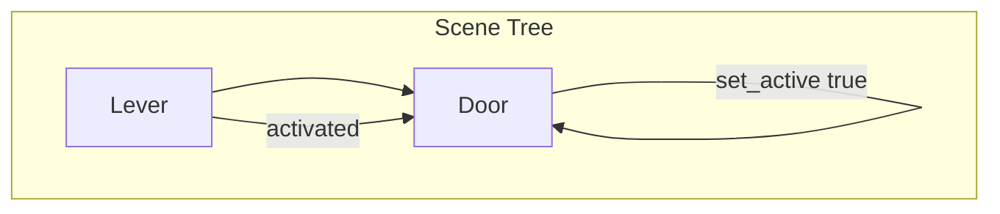
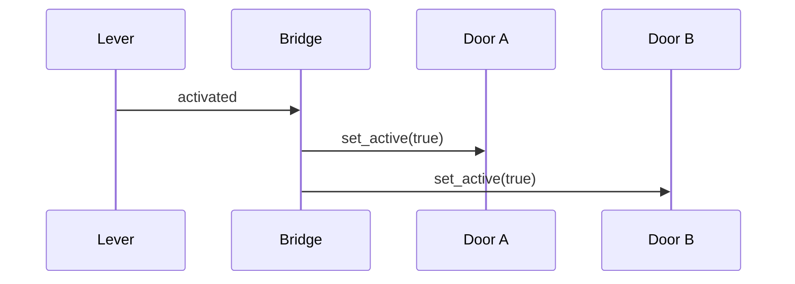
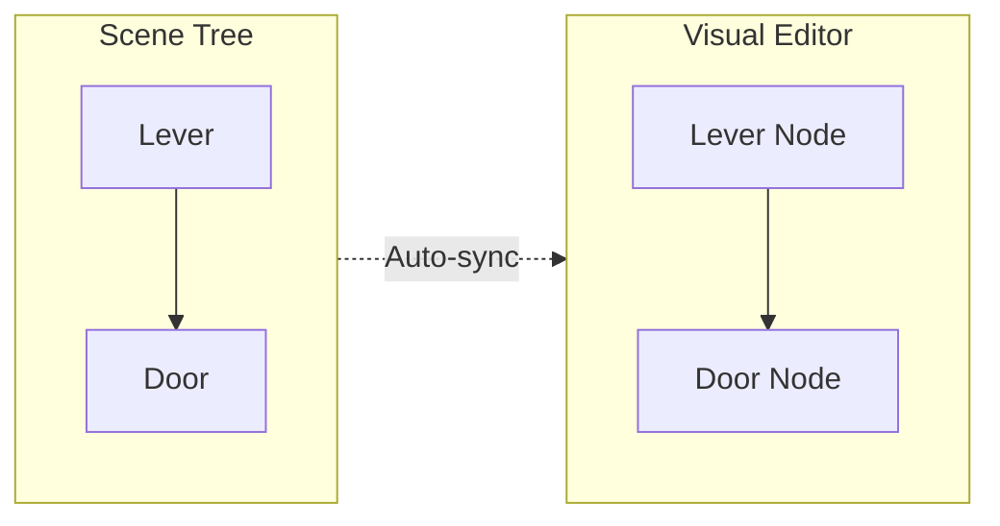
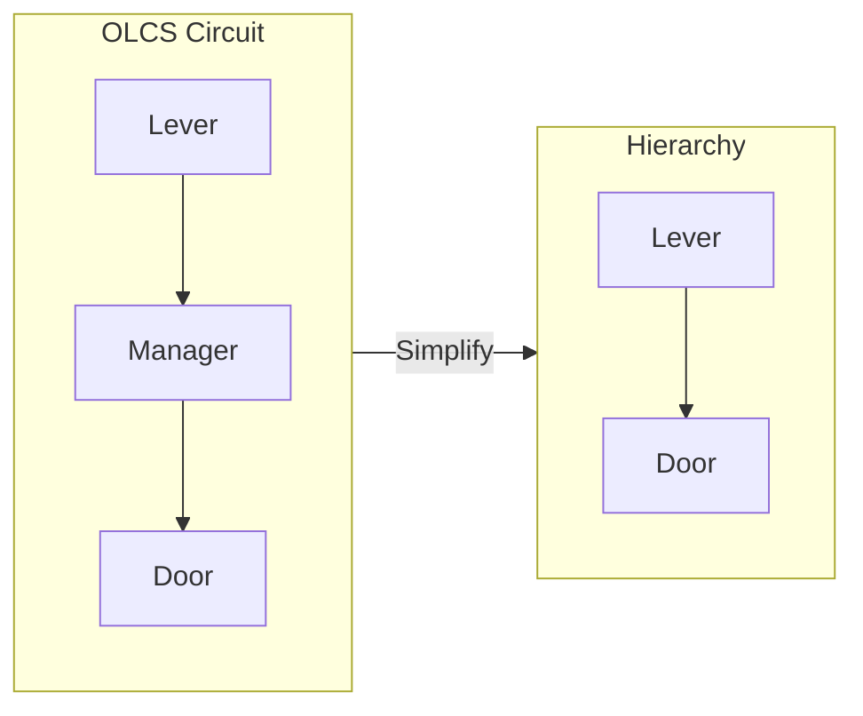

# Hierarchy-Based Linking Patterns

The simplest way to connect interactables is through the scene tree hierarchy. No visual editor required.

## Core Concept

When props are arranged in parent-child relationships, they can auto-connect on `_ready()` without manual wiring.



## Auto-Wiring Mechanism

### PropBaseV2 Implementation

Props inheriting from `PropBaseV2` automatically search for switches:

```gdscript
# In PropBaseV2.gd
func _auto_wire_switches():
    # 1. Check for explicit export
    if linked_switch_path:
        var switch = get_node(linked_switch_path)
        switch.connect("activated", self, "set_active", [true])
        switch.connect("deactivated", self, "set_active", [false])
        return
    
    # 2. Check parent
    var parent = get_parent()
    if parent and parent.has_signal("activated"):
        parent.connect("activated", self, "set_active", [true])
        parent.connect("deactivated", self, "set_active", [false])
        return
    
    # 3. Check children
    for child in get_children():
        if child.has_signal("activated"):
            child.connect("activated", self, "set_active", [true])
            child.connect("deactivated", self, "set_active", [false])
            return
```

## Pattern 1: Switch as Parent

**Use case:** A switch controls one or more props.

```
Lever (RotatingObjectV2)
├── Door (SlidingObjectV2)
└── Light (PropBaseV2)
```

When the lever is activated, both door and light receive `set_active(true)`.

### Scene Setup

1. Create a `RotatingObjectV2` node (the lever)
2. Add a `SlidingObjectV2` as child (the door)
3. Add a `PropBaseV2` as child (the light)
4. No additional configuration needed!

## Pattern 2: Prop as Parent

**Use case:** A prop has an integrated control mechanism.

```
Door (SlidingObjectV2)
└── Keypad (PushButtonV2)
```

The keypad's `activated` signal triggers the door.

### When to Use

- Built-in switches (keypads, panels)
- Compound props with internal logic
- Props that should be self-contained

## Pattern 3: Sibling Discovery

**Use case:** Multiple props share a logical group.

```
LogicGroup (Spatial)
├── Lever (RotatingObjectV2)
├── Door (SlidingObjectV2)
└── Indicator (PropBaseV2)
```

Requires explicit linking via export:

```gdscript
# In Door's inspector
Linked Switch Path: ../Lever
```

## Pattern 4: InteractableBridge

**Use case:** One switch controls many targets, or cross-scene references.

```
Lever (RotatingObjectV2)
└── Bridge (InteractableBridge)
    ├── TargetPath1: ../DoorA
    ├── TargetPath2: ../DoorB
    └── TargetPath3: ../../OtherScene/Light
```

### Bridge Configuration

```gdscript
# InteractableBridge exports
export(Array, NodePath) var target_paths: Array
export(bool) var toggle_mode := true  # true = toggle, false = set same state
```

### Bridge Behavior



## Comparison Table

| Pattern | Max Targets | Cross-Scene | Config Required |
|---------|-------------|-------------|-----------------|
| Switch as Parent | Unlimited | No | None |
| Prop as Parent | 1 (child) | No | None |
| Sibling Discovery | 1 | No | Export path |
| InteractableBridge | Unlimited | Yes | Export paths |

## Visual Editor Reflection

When a `LogicCircuitManager` is present, the visual editor can reflect hierarchy relationships:



### Implementation Status

- [x] Hierarchy auto-wiring works at runtime
- [ ] Visual editor reads hierarchy (planned)
- [ ] Visual editor writes hierarchy (planned)

## Best Practices

### DO

```gdscript
# Good: Simple parent-child
Lever/
├── Door/
└── Light/

# Good: Explicit path for siblings
export(NodePath) var linked_switch_path = @"../Lever"
```

### DON'T

```gdscript
# Bad: Circular reference
Door/
└── Lever/  # Lever controls parent door?
    └── Door/  # Which door?

# Bad: Deep nesting for simple links
Level/
└── Room1/
    └── SwitchGroup/
        └── Lever/
            └── TargetGroup/
                └── Door/  # Too deep!
```

## Debugging Hierarchy Links

### Enable Verbose Logging

```gdscript
# In any PropBaseV2
export(bool) var debug := true
```

Output:
```
[PropBaseV2] Door_01 auto-wired to parent: Lever_01
[PropBaseV2] Light_02 auto-wired to child: Button_01
```

### Runtime Inspection

```gdscript
# Check connections at runtime
for child in $Lever.get_children():
    if child.has_method("set_active"):
        print("Connected: ", child.name)
```

## Migration from OLCS

If you have an existing OLCS circuit that could be simplified:

1. Check if all connections are 1:1
2. If yes, restructure scene tree to use parent-child
3. Remove nodes from CircuitGraphResource
4. Delete LogicCircuitManager if no longer needed



## Advanced: Conditional Auto-Wiring

For props that should only auto-wire under certain conditions:

```gdscript
# In custom prop
func _auto_wire_switches():
    if requires_power and not has_power():
        return  # Don't connect if no power
    
    super._auto_wire_switches()
```

## Summary

| Need | Solution |
|------|----------|
| One switch, one prop | Parent-child hierarchy |
| One switch, multiple props | Switch as parent with multiple children |
| Multiple switches, one prop | Use OLCS or InteractableBridge |
| Cross-scene reference | InteractableBridge |
| Complex logic | OLCS |
