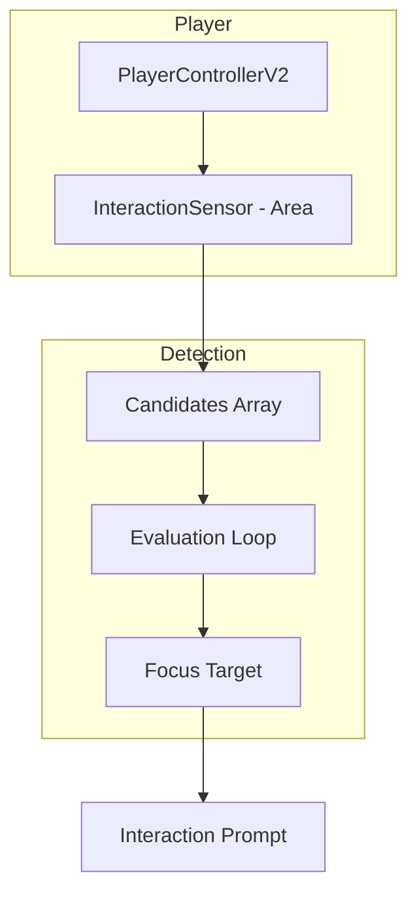

# Interaction System Implementation Plan

This document identifies missing and incomplete components in the interaction system and provides a prioritized implementation roadmap.

## Current State Analysis

### ✅ Complete Components

| Component | Location | Status |
|-----------|----------|--------|
| InteractableBaseV2 | `core_v2/components/InteractableBaseV2.gd` | ✅ Fully implemented |
| PropBaseV2 | `core_v2/components/PropBaseV2.gd` | ✅ Auto-wiring works |
| SlidingObjectV2 | `core_v2/components/SlidingObjectV2.gd` | ✅ Complete |
| RotatingObjectV2 | `core_v2/components/RotatingObjectV2.gd` | ✅ Complete |
| PushButtonV2 | `core_v2/components/PushButtonV2.gd` | ✅ Complete |
| PressurePlateV2 | `core_v2/components/PressurePlateV2.gd` | ✅ Complete |
| LogicCircuitManager | `core_v2/systems/circuit/LogicCircuitManager.gd` | ✅ Runtime works |
| CircuitGraphResource | `core_v2/systems/circuit/CircuitGraphResource.gd` | ✅ Data storage works |
| CircuitCable | `core_v2/systems/circuit/CircuitCable.gd` | ✅ Procedural generation |
| InteractableBridge | `core_v2/components/InteractableBridge.gd` | ✅ Basic bridging |
| test_prop.sh | `./test_prop.sh` | ✅ Validation pipeline |

### ⚠️ Incomplete Components

| Component | Issue | Priority |
|-----------|-------|----------|
| CircuitBoard (Visual Editor) | Missing: Add node UI, property inspector, hierarchy sync | High |
| PropBaseV2 | Auto-wiring only checks parent, not children properly | Medium |
| InteractableBridge | No multi-target export array | Medium |
| CircuitCable | CSG mode crashes in editor without scene assigned | Low |

### ❌ Missing Components

| Component | Description | Priority |
|-----------|-------------|----------|
| InteractionSensor | Volume-based detection for player | High |
| Wireless Connection | OLCS WiFi signal type | Low |

### ✅ Already Exists

| Component | Location | Notes |
|-----------|----------|-------|
| Prop Zoo Scene | `core_v2/tests/TestScenePropZoo.tscn` | Auto-discovers props, creates exhibits with levers |

## Implementation Roadmap

### Phase 1: PropBaseV2 Improvements (Priority: HIGH)

**Goal:** Robust auto-wiring for all hierarchy patterns.

#### Tasks

1. **Fix Child Discovery**
   ```gdscript
   # Current: Only checks parent
   # Fix: Also check children recursively
   
   func _auto_wire_switches():
       # 1. Explicit export
       if linked_switch_path:
           _connect_to(get_node(linked_switch_path))
           return
       
       # 2. Parent check
       if _is_valid_source(get_parent()):
           _connect_to(get_parent())
           return
       
       # 3. Children check (NEW)
       for child in get_children():
           if _is_valid_source(child):
               _connect_to(child)
               return
   ```

2. **Add Multi-Switch Support**
   - [ ] `export(Array, NodePath) var linked_switch_paths`
   - [ ] Connect to all switches in array
   - [ ] OR logic: any switch activates prop

3. **Editor Preview**
   - [ ] Show connection lines in 3D view
   - [ ] Gizmo for CableAnchor position

### Phase 2: Interaction Sensor (Priority: MEDIUM)

**Goal:** Replace raycast interaction with volume-based detection.



#### Tasks

1. **Create InteractionSensor.tscn**
   - [ ] Area node with BoxShape/CollisionShape
   - [ ] Configurable detection range
   - [ ] Attach as child of PlayerControllerV2

2. **Candidate Evaluation**
   - [ ] Track overlapping InteractableBaseV2 nodes
   - [ ] Score by: distance, angle to camera, line of sight
   - [ ] Emit `focus_changed(old, new)` signal

3. **UI Integration**
   - [ ] Show interaction prompt for focused target
   - [ ] Display `interaction_text` from prop
   - [ ] Highlight focused prop's mesh

### Phase 3: Visual Editor Enhancement (Priority: LOW)

**Goal:** Make the Circuit Board usable for designers.

#### Tasks

1. **Add Node Palette**
   - [ ] Create sidebar with draggable node types
   - [ ] PROP node: Drag scene nodes from Scene dock
   - [ ] GATE nodes: AND, OR, XOR, NOT, DELAY buttons

2. **Property Inspector**
   - [ ] Selecting a node shows properties in dock
   - [ ] DELAY gate: editable `delay_time`
   - [ ] Connection: cable material, slack, type dropdown

3. **Hierarchy Sync**
   - [ ] Scan scene tree for parent-child InteractableBaseV2 pairs
   - [ ] Auto-create nodes for hierarchy-linked props
   - [ ] Visual indicator for hierarchy vs manual connections

## File Structure After Implementation

```
core_v2/
├── components/
│   ├── InteractableBaseV2.gd      # ✅ No changes
│   ├── PropBaseV2.gd              # 🔧 Enhanced auto-wiring
│   ├── InteractableBridge.gd      # 🔧 Multi-target support
│   ├── InteractionSensor.gd       # 🆕 New component
│   └── InteractionSensor.tscn     # 🆕 New scene
├── systems/
│   └── circuit/
│       ├── LogicCircuitManager.gd # ✅ No changes
│       ├── CircuitGraphResource.gd# ✅ No changes
│       └── CircuitCable.gd        # 🔧 Editor safety
├── scenes/
│   └── PropStage.tscn             # ✅ Already exists
├── tests/
│   ├── TestScenePropZoo.tscn      # ✅ Already exists
│   └── TestScenePropZoo.gd        # ✅ Already exists
└── scripts/
    └── prop_validator.oys         # ✅ Already exists

addons/
└── odyssey_circuit_editor/
    ├── CircuitBoard.gd            # 🔧 Major enhancement
    ├── CircuitBoard.tscn          # 🔧 Add palette
    ├── NodePalette.tscn           # 🆕 New UI
    └── PropertyInspector.tscn     # 🆕 New UI
```

## Testing Strategy

### Unit Tests

| Component | Test File | Focus |
|-----------|-----------|-------|
| InteractableBaseV2 | `test_interactable_base.gd` | State machine, signals |
| PropBaseV2 | `test_prop_base.gd` | Auto-wiring |
| LogicCircuitManager | `test_logic_circuit.gd` | Gate logic, propagation |
| InteractionSensor | `test_interaction_sensor.gd` | Candidate evaluation |

### Integration Tests (OYS)

| Scenario | Script | Validates |
|----------|--------|-----------|
| Lever → Door | `test_lever_door.oys` | Hierarchy linking |
| AND gate logic | `test_and_gate.oys` | OLCS propagation |
| Cable destruction | `test_cable_sever.oys` | Connection breaking |
| Prop Zoo batch | `test_prop_zoo.oys` | All props animate |

## Effort Estimates

| Phase | Complexity | Dependencies | Priority |
|-------|------------|--------------|----------|
| Phase 1: PropBaseV2 | Low | None | HIGH |
| Phase 2: Interaction Sensor | Medium | None | MEDIUM |
| Phase 3: Visual Editor | High | None | LOW |

**Recommended Order:** Phase 1 → Phase 2 → Phase 3

This order prioritizes fixing existing functionality before adding new features.

## Next Steps

1. **Immediate:** Commit documentation changes
2. **Short-term:** Implement Phase 1 (PropBaseV2 fixes)
3. **Medium-term:** Implement Phase 2 (Interaction Sensor)
4. **Long-term:** Implement Phase 3 (Visual Editor enhancement)
