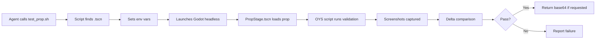
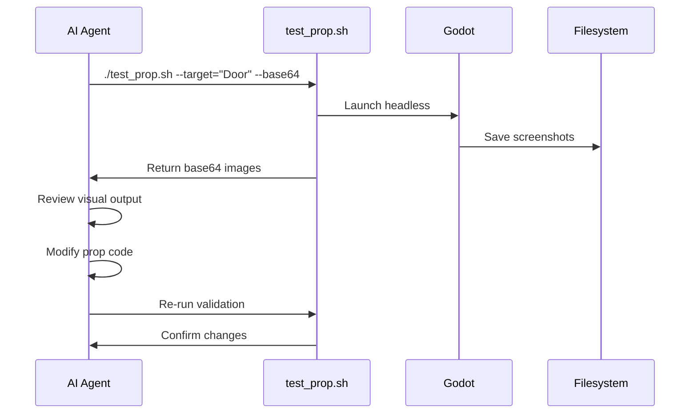

# Prop Validation Pipeline for AI Agents

The `test_prop.sh` script provides a headless validation workflow for interactive props, enabling AI agents to verify visual state changes without running the full game.

## Quick Start

```bash
# Validate a single prop
./test_prop.sh --target="AirlockDoor"

# Validate with base64 image output (for agent review)
./test_prop.sh --target="AirlockDoor" --base64

# Validate ALL props in core_v2/props/
./test_prop.sh

# Use a custom validation script
./test_prop.sh --target="MyProp" --script="res://custom_validator.oys"
```

## How It Works



## Environment Variables

The script sets these environment variables before launching Godot:

| Variable | Purpose |
|----------|---------|
| `OYS_PROP_PATH` | Full `res://` path to the target `.tscn` file |
| `OYS_AUTO_RUN` | Path to the OYS validation script to execute |

## Output Location

All artifacts are saved to:

```
test_output/props/
├── PropName_0_idle.png     # Initial state
├── PropName_1_mid.png      # Mid-animation
├── PropName_2_active.png   # Fully activated
└── PropName_3_off.png      # Deactivated (if applicable)
```

## Validation Criteria

### Delta Assertion

The script verifies that screenshots differ by at least `MIN_DELTA_PERCENT` (default 0.5%):

```bash
# Idle → Mid: Should show interaction starting
# Idle → Active: Should show clear visual change
```

If pixels don't change enough, the prop may not be visually responding to state changes.

### Custom Threshold

```bash
./test_prop.sh --target="SubtleProp" --min-delta=0.2
```

## OYS Script Resolution

The script searches for validation scripts in this order:

1. **Same directory as prop**: `PropName.oys` next to `PropName.tscn`
2. **Scripts directory**: `core_v2/scripts/PropName.oys`
3. **Tests directory**: `core_v2/tests/PropName.oys`
4. **Fallback**: `core_v2/scripts/prop_validator.oys`

## Writing Custom Validators

Create a `.oys` file to customize validation:

```gdscript
# core_v2/props/AirlockDoor.oys
extends "res://core_v2/scripts/prop_validator.oys"

# Override default behavior
func _custom_validation():
    var prop = get_prop()
    
    # Wait for initial state
    yield(wait_frames(10), "completed")
    capture("idle")
    
    # Activate
    prop.set_active(true)
    yield(wait_for_animation(prop), "completed")
    capture("open")
    
    # Test with delay
    yield(wait_seconds(2.0), "completed")
    capture("settled")
```

### Available Helper Functions

| Function | Purpose |
|----------|---------|
| `get_prop()` | Returns the loaded prop instance |
| `capture(label: String)` | Saves screenshot with label |
| `wait_frames(n: int)` | Yields for n frames |
| `wait_seconds(t: float)` | Yields for t seconds |
| `wait_for_animation(prop)` | Yields until animation completes |

## Agent Workflow

### Iterative Development



### Best Practices for Agents

1. **Always use `--base64`** when you need to review visuals
2. **Check delta assertions** - if they fail, the prop isn't animating
3. **Run validation after every change** to catch regressions
4. **Use custom OYS scripts** for complex multi-state props

## Common Issues

### No Screenshots Generated

| Cause | Solution |
|-------|----------|
| Prop not found | Check spelling, ensure `.tscn` exists in `core_v2/props/` |
| OYS script error | Check `./reports/gdunit_runner.log` for errors |
| Godot crash | Verify `godot3-bin` is available |

### Delta Assertion Fails

| Cause | Solution |
|-------|----------|
| `_update_visuals()` not implemented | Implement the method in your prop |
| Animation too subtle | Increase `--min-delta` threshold |
| Animation not triggered | Check `set_active()` is being called |
| Same state captured twice | Verify OYS script timing |

### Import Metadata Artifacts

If you see "non-PNG artifact" warnings:

```bash
# Clean import metadata
find . -name "*.import" -delete
```

## Integration with CI

```yaml
# .github/workflows/prop_validation.yml
- name: Validate Props
  run: |
    ./test_prop.sh
    if [ $? -ne 0 ]; then
      echo "Prop validation failed"
      exit 1
    fi
```

## PropStage Scene

The validation uses `core_v2/scenes/PropStage.tscn` as a minimal environment:

- Camera positioned for consistent framing
- Lighting for visibility
- No player or physics interference

### Custom Stage

To use a different stage, modify the script:

```bash
# In test_prop.sh, line ~132
$GODOT_BIN --path "$PROJECT_PATH" "res://path/to/CustomStage.tscn" --no-window --quit-after 200
```

## Output for Agent Review

When using `--base64`, output format is:

```
---BEGIN_BASE64_IMAGE:PropName_0_idle.png---
iVBORw0KGgoAAAANSUhEUgAAA...
---END_BASE64_IMAGE---
---BEGIN_BASE64_IMAGE:PropName_1_mid.png---
iVBORw0KGgoAAAANSUhEUgAAA...
---END_BASE64_IMAGE---
```

Decode and display these to review the prop's visual states.

## Summary Checklist

For AI agents creating or modifying props:

- [ ] Prop inherits from `InteractableBaseV2` or subclass
- [ ] `_update_visuals()` implemented as pure function of `anim_progress`
- [ ] Run `./test_prop.sh --target="PropName" --base64`
- [ ] Review base64 images for correct visual states
- [ ] Verify delta assertions pass (visual change detected)
- [ ] Check `./reports/gdunit_runner.log` if errors occur
- [ ] Iterate until validation passes
