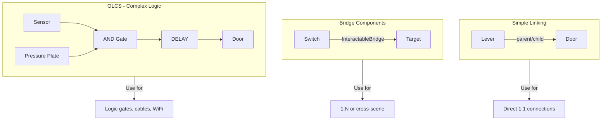
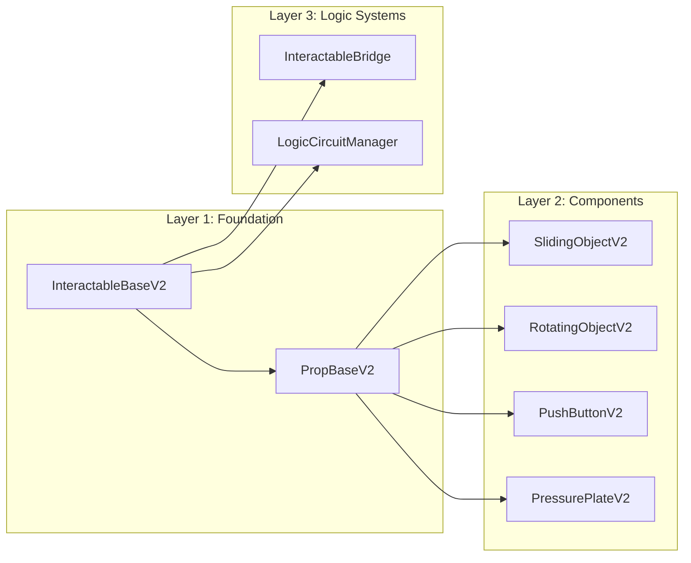

# Odisea Interaction System

A unified framework for creating deterministic, replay-safe interactive objects in the Odisea game engine.

## Overview

The Interaction System provides three complementary approaches to connecting gameplay elements:

## Core Principles

1. **Determinism First**: All interactive objects use `anim_progress` (0.0-1.0) as a pure function of time, ensuring frame-perfect replays.

2. **OLCS is Optional**: The Odyssey Logic Circuit System (OLCS) is compatible with all interactables but never required. Simple connections work without it.

3. **Hierarchy Preferred**: When possible, use parent-child relationships in the scene tree. The visual editor reflects these relationships.

4. **Idle Culling (FD-224)**: Interactables stop their `_physics_process` once the animation reaches its target. If a prop must keep updating *at rest* (e.g. a flickering light), it MUST override `_wants_continuous_step()` — see [CONTRACT.md → Idle Culling](CONTRACT.md#idle-culling-fd-224-and-_wants_continuous_step).

## Quick Reference

| Use Case | Recommended Approach |
|----------|---------------------|
| Lever opens a door | Hierarchy linking |
| Button triggers multiple objects | InteractableBridge |
| Pressure plate + lever = door | OLCS with AND gate |
| Destructible cable connection | OLCS with CircuitCable |
| Wireless remote control | OLCS with WiFi connection |

## Documentation Index

- **[CONTRACT.md](CONTRACT.md)** - Technical specification for `InteractableBaseV2` and subclasses
- **[OLCS.md](OLCS.md)** - Odyssey Logic Circuit System visual editor and runtime
- **[HIERARCHY_LINKING.md](HIERARCHY_LINKING.md)** - Scene tree patterns for simple connections
- **[PROP_VALIDATION.md](PROP_VALIDATION.md)** - `test_prop.sh` pipeline for AI agents

## Architecture Layers

## Key Files

| File | Purpose |
|------|---------|
| `core_v2/components/InteractableBaseV2.gd` | Abstract base class |
| `core_v2/components/PropBaseV2.gd` | Tool-enabled prop with auto-wiring |
| `core_v2/systems/circuit/LogicCircuitManager.gd` | OLCS runtime executor |
| `addons/odyssey_circuit_editor/` | Visual graph editor plugin |

## For AI Agents

When creating or modifying props, always:

1. Inherit from `InteractableBaseV2` or appropriate subclass
2. Implement `_update_visuals()` to map `anim_progress` to visual state
3. Run `./test_prop.sh --target="PropName" --base64` to validate
4. Check output in `./reports/gdunit_runner.log`

See [PROP_VALIDATION.md](PROP_VALIDATION.md) for the complete pipeline specification.
